Storyboard

Generated on: 2026-09-24

Selected categories: All  
Selected countries: Italy  
Selected story IDs: All

# Story summary

Unique stories found: 119

Total number of category assignments: 213

# Categories sorted by story count:

Living together and Community: 38 stories

Fairness and social justice: 35 stories

Mobilty and transport: 19 stories

Education and Schools: 18 stories

Health and Wellbeing: 17 stories

Democracy and Goverance: 16 stories

Nature and climate: 15 stories

Work and Occupation: 14 stories

Other, please specify : 11 stories

Housing and Living Conditions: 10 stories

Migration and Refugees: 8 stories

Peace and Security: 7 stories

Economy and Markets: 5 stories

# Plots

## 1.3 Experience sentiment histogram

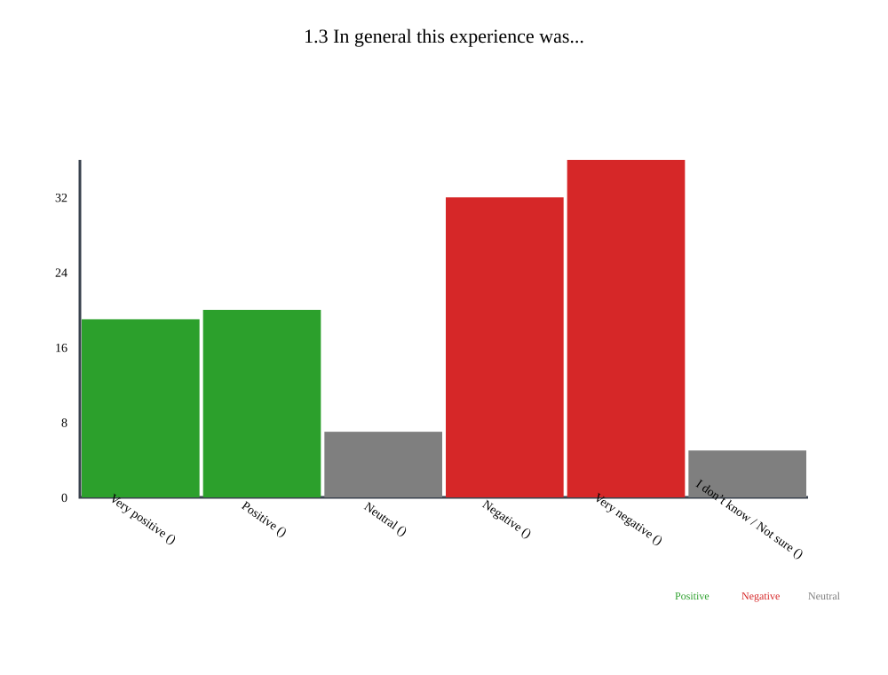

## 2.1 In the experience you shared, what matters most are... histogram

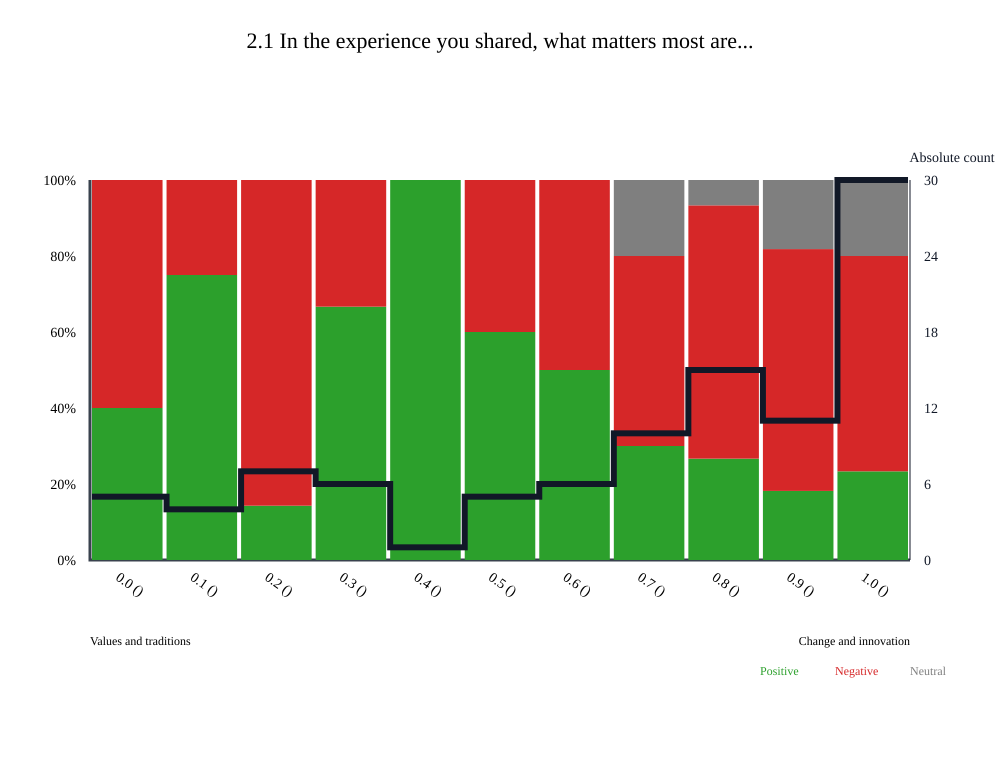

## 2.2 In the experience you shared, others behave... histogram

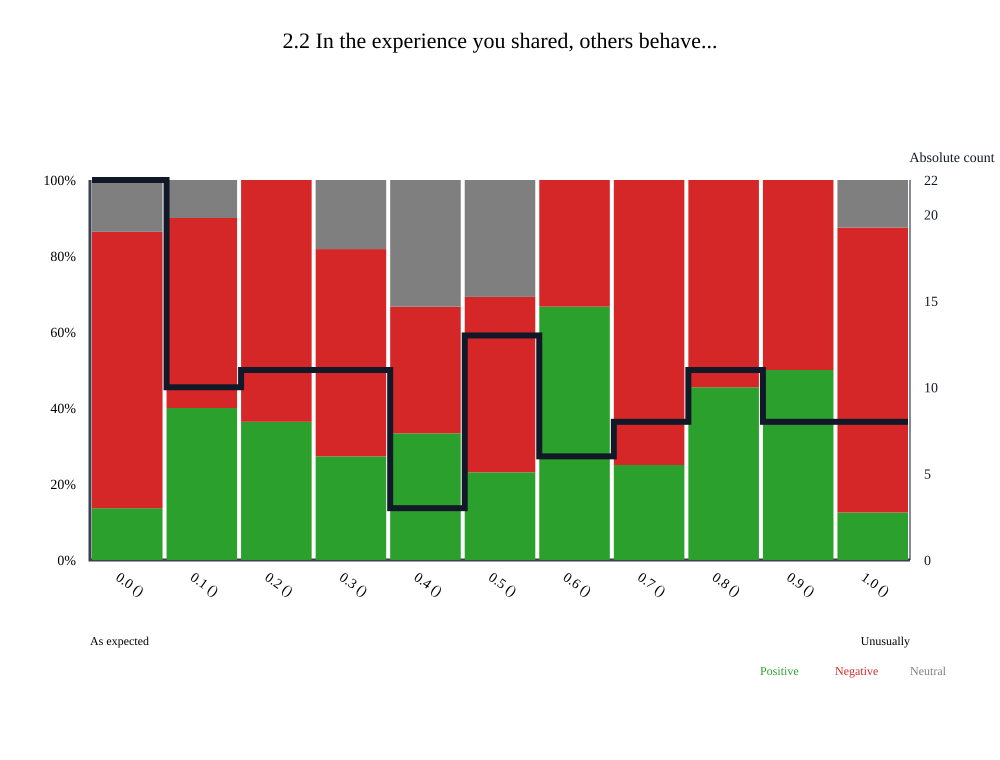

## 2.3 In the experience you shared, everybody is treated ... histogram

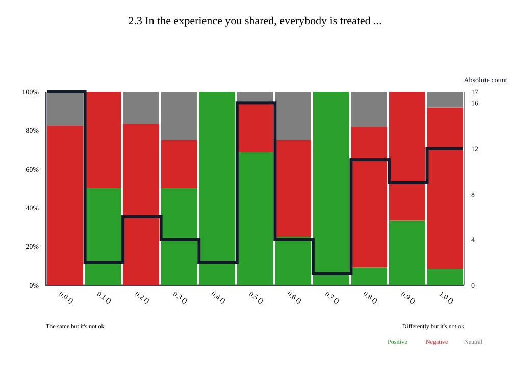

## 2.4 In the experience you shared, you feel the government... histogram

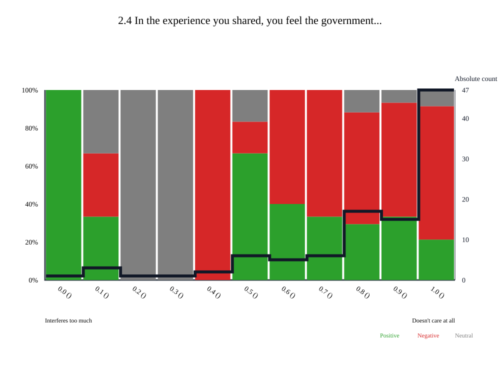

## 6.3 Experience frequency histogram

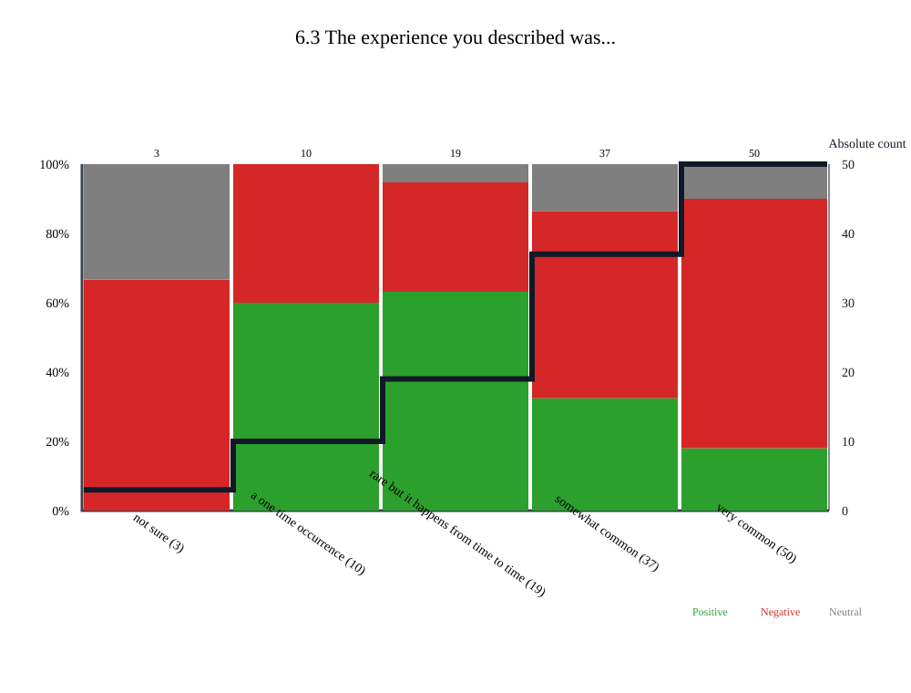

## 6.4 Experience origin histogram

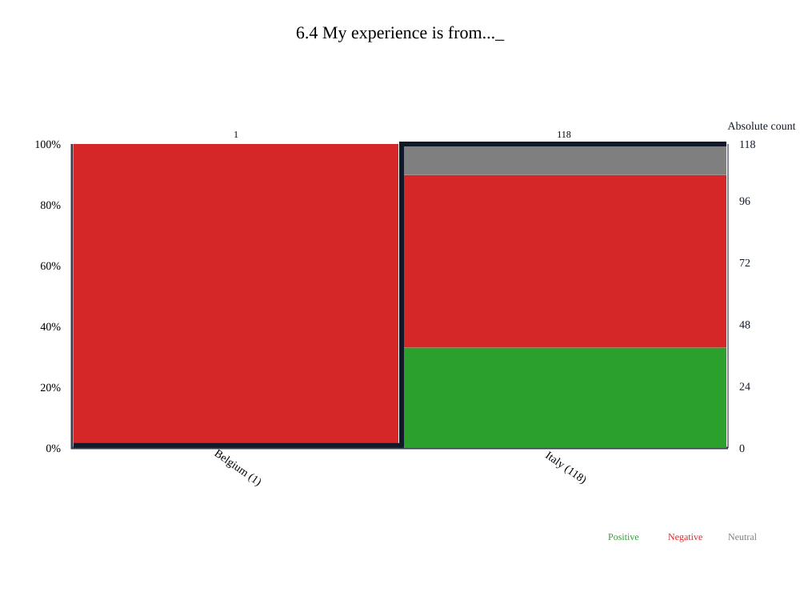

- Belgium: 1 stories
- Italy: 119 stories
- Spain: 1 stories

## 6.6 Age histogram

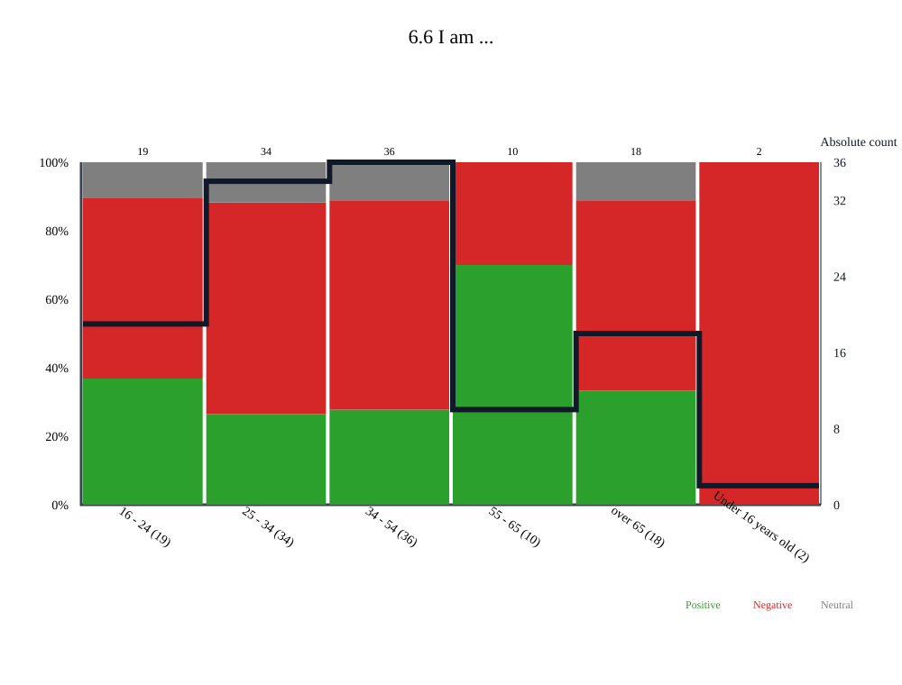

## 6.5 Identity histogram

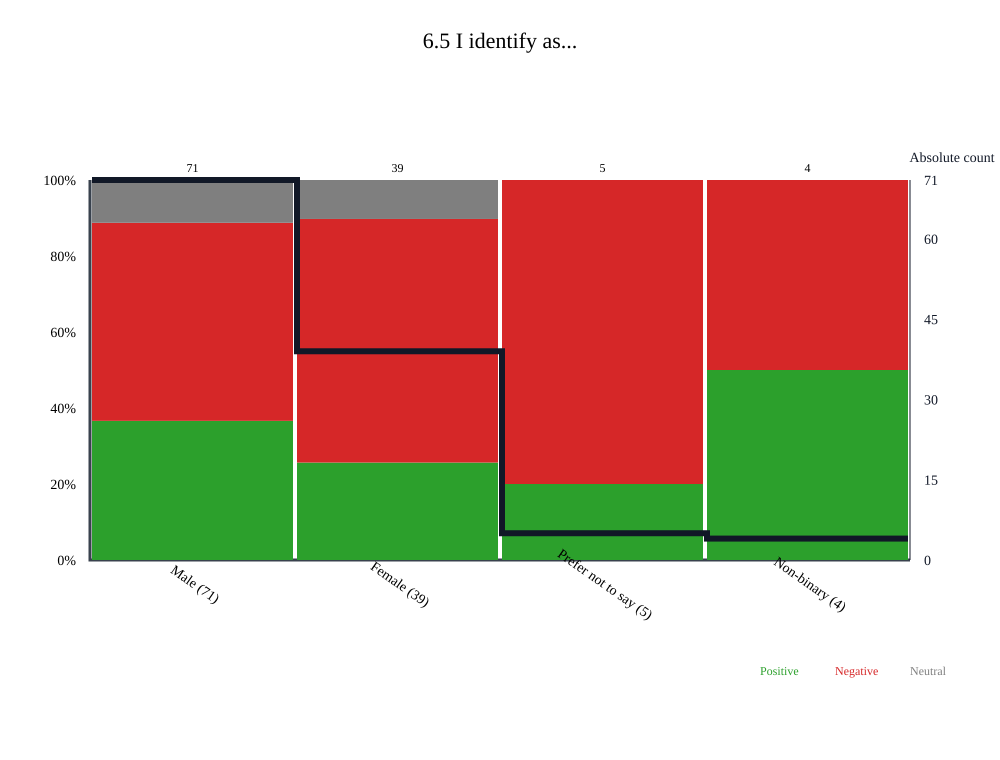

## 5.1 For me, the EU is like... word cloud

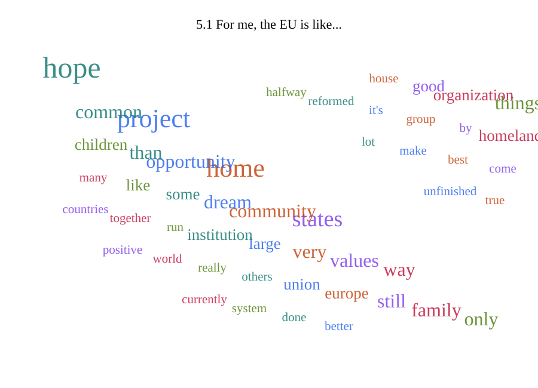

## 5.2 For me, Europe is like... word cloud

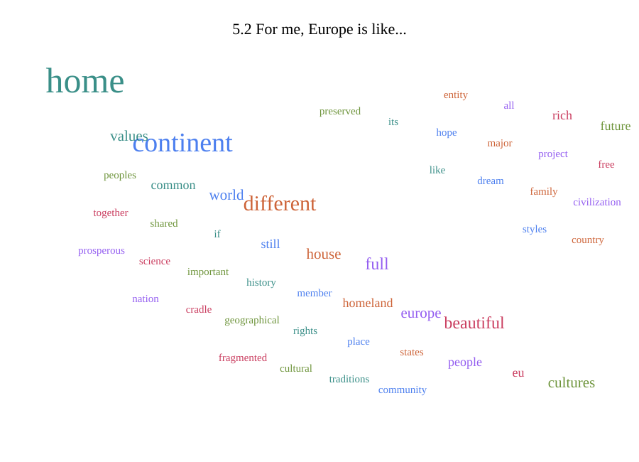

## 5.3 For me, democracy is like... word cloud

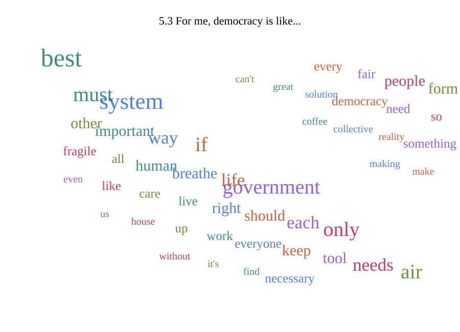

## 6.1 Who should hear your story? word cloud

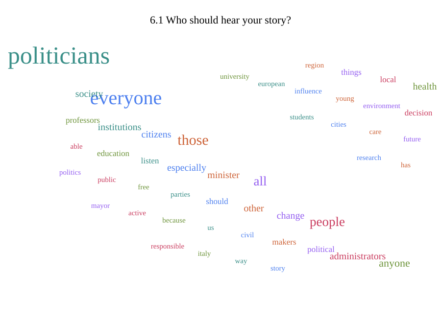

## 6.2 If you could ask one question to people in power, what would it be? word cloud

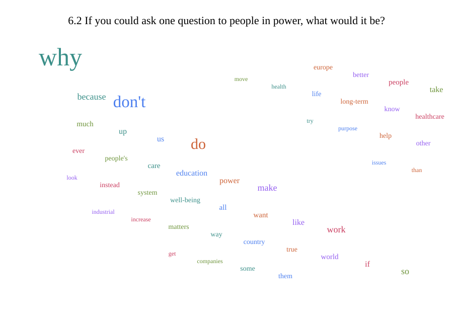

# All unique stories with their number and full text:

## 1. Italians but without citizenship

I met an Italian girl of Nigerian origins who encountered obstacles in her sports career due to the fact that she did not possess Italian citizenship.

<u>Original title (it)</u> : Italiani ma senza cittadinanza 

<u>Original content (it)</u> :

Ho conosciuto una ragazza italiana ma di origini nigeriane che ha trovato ostacoli nella sua carriera sportiva a causa del fatto che non risultasse in possesso della cittadinanza italiana.

<u>Origin</u> : Italy

<u>Language</u> : it

<u>Unique identifier</u> : IT_pmt_sp

<u>EU is like</u> : A utopian project to commit to

<u>Europe is like</u> : Different peoples with intertwined histories

<u>Democracy is like</u> : A long and tiring process

<u>Who should hear this</u> : Everyone!!! Politicians, political parties, activist movements, civil society, citizens

<u>Question</u> : 

<u>The experience was</u> : Very negative

<u>This story also appears in</u> : Fairness and social justice

## 2. Bitter courtesy

One evening I went to a restaurant.  
The hostess had been very helpful and kind throughout the meal. When it was time to pay, I found myself with a bill that was much higher than I'd originally agreed upon. The hostess, when paying, didn't issue a receipt and gave me a discount, but it was still negligible compared to the amount I'd originally expected to pay.

<u>Original title (it)</u> : Amara cortesia

<u>Original content (it)</u> :

Una sera sono andato al ristorante.  
Durante tutto il pasto la padrona di casa era stata molto disponibile e gentile. Giunti alla fine era il momento di pagare mi sono ritrovato un conto che era molto più alto di quello prestabilito. La padrona, nel momento del pagamento, non batte scontrino e mi fa uno sconto, ma comunque irrisorio se paragonato alla cifra che mi aspettavo di pagare in origine.

<u>Origin</u> : Italy

<u>Language</u> : it

<u>Unique identifier</u> : IT_pmt_sp

<u>EU is like</u> : A roof without a house

<u>Europe is like</u> : A sleeping giant

<u>Democracy is like</u> : A poorly oiled machine

<u>Who should hear this</u> : Politicians and consumers

<u>Question</u> : Look at reality and not ideologies

<u>The experience was</u> : Very negative

<u>This story also appears in</u> : Living together and Community

## 3. Ecological shortsightedness of industries and workers.

For years, I have been fighting against the fact that in industries and workplaces, the bare minimum is done to protect the health and safety of workers, environmental impact is neglected, and European regulations are considered a bureaucratic burden and a drag on profits. The reality is that these rules protect everyone, yet those directly affected seem unaware of the risks and damage they cause to the environment, to others, and, above all, to themselves.  
  
Workers themselves aren't concerned about this situation, and even when they are empowered to perform well, they tend to operate without the safety measures provided.  
  
In other words, there is a lack of culture and awareness, and widespread shortsightedness regarding workplace safety and health.

<u>Original title (it)</u> : Miopia ecologica delle industrie e dei lavoratori.

<u>Original content (it)</u> :

Da anni combatto contro il fatto che nelle industrie e sui luoghi di lavoro si faccia il minimo possibile per tutelare la sicurezza e la salute dei lavoratori, si trascura l'impatto ambientale e si considerano le normative europee un peso burocratico ed una zavorra al profitto. La realtà è che queste regole tutelano tutte le persone, ma sembra che i diretti interessati non si rendano conto dei rischi e dei danni che arrecano all'ambiente, agli altri, ma soprattutto a se stessi.  
  
Gli stessi lavoratori non si preoccupano di questa situazione e, anche quando li metti in condizione di lavorare bene, tendenzialmente operano senza le sicurezze fornite.  
  
In altre parole, c'è una mancanza di cultura e di consapevolezza ed una miopia diffusa sul tema della sicurezza e della salute sui luoghi di lavoro.

<u>Origin</u> : Italy

<u>Language</u> : it

<u>Unique identifier</u> : IT_pmt_sp

<u>EU is like</u> : the compass that indicates the correct way to manage this problem.

<u>Europe is like</u> : the meeting of different skills and abilities, which, if enabled to collaborate, bring great benefits.

<u>Democracy is like</u> : an ineffective way to find a fair solution; in reality, one seeks a solution that is acceptable to the majority (even if it is unfair).

<u>Who should hear this</u> : Entrepreneurs and politicians.

<u>Question</u> : Could you increase inspections at companies to ensure health, safety, and environmental protection?

<u>The experience was</u> : Negative

<u>This story also appears in</u> : Nature and climate, Health and Wellbeing, Work and Occupation

## 4. Victim of the green transition or of the Italian authorities?

I have a car in excellent condition, but it's a Euro 5 diesel, and I'll probably no longer be able to use it in September. The regional government hasn't given any guidance on this matter, and this fact has truly created a climate of uncertainty for me and everyone else in the same situation.  
This issue surfaces in the media every now and then, but nothing is clear.

<u>Original title (it)</u> : Vittima della transizione green o delle autorità italiane?

<u>Original content (it)</u> :

Ho una macchina in ottime condizioni, ma è un euro 5 diesel e probabilmente  a settembre non potrò più utilizzarla. L'amministrazione regionale non da' nessuna indicazione in merito e questo fatto crea veramente un clima di incertezza in me e tutti quelli che si trovano nella stessa situazione.  
A livello di mass media ogni tanto questa cosa emerge, ma non c'è nulla di chiaro

<u>Origin</u> : Italy

<u>Language</u> : it

<u>Unique identifier</u> : IT_pmt_sp

<u>EU is like</u> : Neverland by Edoardo Bennato

<u>Europe is like</u> : A quarrelsome chicken coop

<u>Democracy is like</u> : a crystal vase

<u>Who should hear this</u> : The President of the Region and the Minister of the Environment

<u>Question</u> : 

<u>The experience was</u> : Negative

<u>This story also appears in</u> : Mobilty and transport, Nature and climate, Living together and Community

## 5. Patent

I recently started working on getting my driver's license. I hope to get it soon, especially since the process hasn't been the easiest, especially with the long waiting lists and very high prices.

<u>Original title (it)</u> : Patente

<u>Original content (it)</u> :

Ultimamente ho intrapreso il percorso per riuscire a prendere la patente. Spero di prenderla presto, soprattutto perché il percorso non è stato dei più facili, soprattutto per quanto riguarda le lunghe liste d’attesa e i prezzi molto elevati.

<u>Origin</u> : Italy

<u>Language</u> : it

<u>Unique identifier</u> : IT_pmt_sp

<u>EU is like</u> : 

<u>Europe is like</u> : 

<u>Democracy is like</u> : 

<u>Who should hear this</u> : Who is able to manage and change the situation for the better

<u>Question</u> : 

<u>The experience was</u> : Neutral

<u>This story also appears in</u> : Mobilty and transport, Fairness and social justice, Education and Schools

## 6. Common good

Political meeting on European community projects for social and work inclusion

<u>Original title (it)</u> : Bene comune 

<u>Original content (it)</u> :

Incontro politico sulla comunità Progetti europei di inclusione sociale e lavorativa 

<u>Origin</u> : Italy

<u>Language</u> : it

<u>Unique identifier</u> : IT_pmt_sp

<u>EU is like</u> : 

<u>Europe is like</u> : 

<u>Democracy is like</u> : 

<u>Who should hear this</u> : 

<u>Question</u> : 

<u>The experience was</u> : Neutral

<u>This story also appears in</u> : Living together and Community

## 7. Precarious employment assured

University researchers work in a state of constant precariousness. In recent years, several reforms have attempted to improve job security for these individuals. However, policymakers have proven incapable of addressing this precariousness, or even intent on exacerbating it. This situation makes university research in Italy an unattractive occupation for few people (those who can afford to spend 10-15 years of their career in a state of uncertainty). This condition slows down social development and innovation.

<u>Original title (it)</u> : Precariato assicurato

<u>Original content (it)</u> :

Il personale ricercatore all'interno dell'università lavora in uno stato di costante precariato. Negli ultimi anni, alcune riforme hanno teso a migliorare la stabilità lavorativa di queste persone. Tuttavia,  la politica si dimostra incapace di risolvere questa precarietà o addirittura intenzionata ad accentuarla. Questa situazione rende la ricerca universitaria in Italia un impiego poco attrattivo e per poche persone (coloro che possono permettersi di trascorrere 10-15 anni della propria cariera in uno stato di incertezza). Questa condizione rallenta lo sviluppo e l'innovazione della società.

<u>Origin</u> : Italy

<u>Language</u> : it

<u>Unique identifier</u> : IT_pmt_sp

<u>EU is like</u> : 

<u>Europe is like</u> : 

<u>Democracy is like</u> : 

<u>Who should hear this</u> : 

<u>Question</u> : 

<u>The experience was</u> : Negative

<u>This story also appears in</u> : Work and Occupation

## 8. Using computer technology today is helpful

I booked a medical check-up for July 2025.  
Through the Salute Piemonte app, I found a spot for the day after my last request, months in advance.  

<u>Original title (it)</u> : Usare la tecnologia informatica oggi, è utile 

<u>Original content (it)</u> :

Ho prenotato un accertamento medico per luglio 2025.  
Tramite la app Salute Piemonte ho trovato un posto per il giorno successivo alla mia ultima richiesta, con mesi d'anticipo.  

<u>Origin</u> : Italy

<u>Language</u> : it

<u>Unique identifier</u> : IT_pmt_sp

<u>EU is like</u> : The organization of the condominium

<u>Europe is like</u> : Condominium

<u>Democracy is like</u> : Synergy

<u>Who should hear this</u> : Everyone

<u>Question</u> : 

<u>The experience was</u> : Very positive

<u>This story also appears in</u> : Health and Wellbeing

## 9. Demagony

I was invited as a panelist to talk about Europe in a school.  
The students (16-19 y.o.) knew absolutely nothing about the EU Institutions and the democratic institutions in general. That was appalling.

<u>Origin</u> : Italy

<u>Language</u> : en

<u>Unique identifier</u> : IT_pmt_sp

<u>EU is like</u> : hope. The only hope. When it becomes a geopolitical actor.

<u>Europe is like</u> : the EU Member States + hopefully future Member States (when they all become fully democratic and embrace free economy).

<u>Democracy is like</u> : the best attempt at building a (wooden) house that we have come to so far.

<u>Who should hear this</u> : Policymakers.  
Politicians.  
Local administrators.  
Professors and educators.  
Parents.  
Lovers of free Society.

<u>Question</u> : Do you want to be remembered as a true prima/us inter pares?

<u>The experience was</u> : Negative

<u>This story also appears in</u> : Democracy and Goverance, Living together and Community, Education and Schools

## 10. What the hell?

My son was born in Germany but we are Italians. When I came back to my home town recently, I found out that he was registered at the Registry of Italians residing abroad but the Italian consulate never transmitted the information to the Italian bureaucracy and therefore he didn't existed and didn't had a tax id or healthcare coverage (for example) in Italy.

<u>Origin</u> : Italy

<u>Language</u> : en

<u>Unique identifier</u> : 

<u>EU is like</u> : A promise

<u>Europe is like</u> : An ambition

<u>Democracy is like</u> : Essential

<u>Who should hear this</u> : 

<u>Question</u> : 

<u>The experience was</u> : Negative

<u>This story also appears in</u> : Democracy and Goverance, Other, please specify 

## 11. Nothing changes

I felt little involved and disillusioned with the pro-Palestinian protests, I saw the repetition of social mechanisms and slogans, without a concrete effect on my reality

<u>Original title (it)</u> : Nulla cambia

<u>Original content (it)</u> :

mi sono sentito poco coinvolto e disilluso, riguardo alle proteste propalestina, ho visto il ripetersi di meccanismi sociali e slogan, senza un effetto concreto sulla mia realtà

<u>Origin</u> : Italy

<u>Language</u> : it

<u>Unique identifier</u> : voltsense

<u>EU is like</u> : 

<u>Europe is like</u> : 

<u>Democracy is like</u> : 

<u>Who should hear this</u> : 

<u>Question</u> : 

<u>The experience was</u> : Negative

<u>This story also appears in</u> : Fairness and social justice

## 12. Something really important

He participated in the Pro Pal strike on October 3rd. It was an incredible experience, when he and the others blocked the ring road. The people in the cars agreed with them, the police behaved well, and the violent perpetrators were isolated.

<u>Original title (it)</u> : Qualcosa di davvero importante 

<u>Original content (it)</u> :

Ha partecipato allo sciopero pro pal del tre ottobre. Un'esperienza incredibile, quando ha bloccato con gli altri la tangenziale. Le persone in auto erano d'accordo con loro, la polizia si è comportata bene e i violenti sono stati isolati.

<u>Origin</u> : Italy

<u>Language</u> : it

<u>Unique identifier</u> : voltsense

<u>EU is like</u> : 

<u>Europe is like</u> : 

<u>Democracy is like</u> : 

<u>Who should hear this</u> : 

<u>Question</u> : 

<u>The experience was</u> : Very positive

<u>This story also appears in</u> : Fairness and social justice, Peace and Security

## 13. Arancini

I made a card for the closing of a local business, to leave a thought together with the group of people with whom I frequented this place over time

<u>Original title (it)</u> : Arancini

<u>Original content (it)</u> :

ho fatto un biglietto per la chiusura di un'attività locale, per lasciare un pensiero insieme al gruppo di persone con cui ho frequentato questo posto nel tempo

<u>Origin</u> : Italy

<u>Language</u> : it

<u>Unique identifier</u> : voltsense

<u>EU is like</u> : .

<u>Europe is like</u> : .

<u>Democracy is like</u> : .

<u>Who should hear this</u> : 

<u>Question</u> : 

<u>The experience was</u> : Very positive

<u>This story also appears in</u> : Fairness and social justice, Living together and Community

## 14. Martial art is politics

She's been practicing Capoeira for five years. It's an experience of cultural intersection, which allows her to travel, meet people, build communities, and escape the daily rhythms of capitalism.

<u>Original title (it)</u> : Arte marziale è politica

<u>Original content (it)</u> :

Fa Capoeira da 5 anni. È un'esperienza di incontro di culture, che le permette di viaggiare, conoscere persone, costruire comunità e uscire dai ritmi quotidiani del capitalismo

<u>Origin</u> : Italy

<u>Language</u> : it

<u>Unique identifier</u> : voltsense

<u>EU is like</u> : 

<u>Europe is like</u> : 

<u>Democracy is like</u> : 

<u>Who should hear this</u> : All of us, to free ourselves from the constraints of acting and thinking in the capitalist world, to find community in interpersonal contact.

<u>Question</u> : 

<u>The experience was</u> : Very positive

<u>This story also appears in</u> : Fairness and social justice, Living together and Community

## 15. Endless wait at the emergency room

The other day I waited six hours in the emergency room while I was accompanying my grandmother who was ill

<u>Original title (it)</u> : Attesa infinita al pronto soccorso 

<u>Original content (it)</u> :

L'altro giorno ho aspettato sei ore al pronto soccorso mentre accompagnavo mia nonna che stava male

<u>Origin</u> : Italy

<u>Language</u> : it

<u>Unique identifier</u> : voltsense

<u>EU is like</u> : A desperate single mother with many children where the father has run away, some children are getting into drugs and others are messing around

<u>Europe is like</u> : A long shared history, a safe place

<u>Democracy is like</u> : My job. It's not that great but that's what I have.

<u>Who should hear this</u> : The Minister of Health and De Pascale. Also Saponaro and Mozzarelli. The Order of Psychologists, who, however, never listen to anyone.

<u>Question</u> : Why don't you invest better in healthcare?

<u>The experience was</u> : Very negative

<u>This story also appears in</u> : Fairness and social justice, Health and Wellbeing

## 16. Rights are appreciated more when we don't have them.

While handing out flyers for the citizenship referendum, I met many different people. Some were unfortunately very aggressive, but I met an elderly woman who, in talking to me, remembered her mother's words, telling her to always vote, because she didn't have that right when she was young.

<u>Original title (it)</u> : I diritti si apprezzano di più quando non li abbiamo

<u>Original content (it)</u> :

Facendo il volantinaggio per il referendum cittadinanza ho incontrato molte persone diverse. Alcune persone erano purtroppo molto aggressive, ma ho incontrato una signora anziana che parlando con me si è ricordata le parole di sua madre che le diceva di andare a votare sempre, perché lei da giovane non aveva questo diritto.

<u>Origin</u> : Italy

<u>Language</u> : it

<u>Unique identifier</u> : IT_pmt_sp

<u>EU is like</u> : A ray of sunshine for a better future

<u>Europe is like</u> : A unique entity

<u>Democracy is like</u> : The best form of government

<u>Who should hear this</u> : They should listen not to my story, but to the lady's.

<u>Question</u> : What is your true purpose?

<u>The experience was</u> : Positive

<u>This story also appears in</u> : Fairness and social justice

## 17. The inability to remain silent on public transport

A manager from some company spent his train ride in front of me shouting at his colleagues, not realizing the annoyance he was causing and provoking on other passengers, as well as the unprofessionalism of speaking badly of his colleagues to other colleagues.

<u>Original title (it)</u> : L'incapacità al silenzio nei mezzi pubblici

<u>Original content (it)</u> :

Un manager di una qualche azienda ha passato il suo viaggio in treno di fronte a me a sparlare dei suoi colleghi con altri colleghi urlando e non rendendosi conto del fastidio causato e provocato sugli altri passeggeri oltre alla poca professionalità nel parlare male dei suoi colleghi con altri colleghi.

<u>Origin</u> : Italy

<u>Language</u> : it

<u>Unique identifier</u> : IT_pmt_sp

<u>EU is like</u> : A group of states that come together to discuss common issues

<u>Europe is like</u> : A group of peoples who should and could unite to share a common project

<u>Democracy is like</u> : An important principle to share and to preserve and cultivate

<u>Who should hear this</u> : The population

<u>Question</u> : Do you consider people's health and well-being more important than industrial and monetary policy?  

<u>The experience was</u> : Negative

<u>This story also appears in</u> : Mobilty and transport

## 18. A touching experience that makes you reflect on the situation Italy is facing.

The general degradation of the city, one day I was walking through Piazza Statuto, and I noticed that compared to a couple of years ago, the presence of homeless people has increased, which makes me think that lately more and more people are in difficulty and something should be done to solve the problems of poverty, lack of money to make ends meet that force people to live in conditions of hardship or absolute poverty.

<u>Original title (it)</u> : Un' esperienza, toccante , che fa riflettere sulla situazione che l'Italia sta affrontando 

<u>Original content (it)</u> :

Il degrado generale della città, un giorno stavo passeggiando per Piazza statuto, e ho notato che rispetto a un paio di anni fa , è aumentata la presenza dei senza tetto, la cosa mi fa pensare che ultimamente sempre più persone sono in difficoltà e bisognerebbe fare qualcosa per risolvere i problemi, di povertà, mancanza di soldi per arrivare a fine mese che costringono le persone a vivere in condizioni di disagio o povertà assoluta

<u>Origin</u> : Italy

<u>Language</u> : it

<u>Unique identifier</u> : IT_pmt_sp

<u>EU is like</u> : 

<u>Europe is like</u> : 

<u>Democracy is like</u> : 

<u>Who should hear this</u> : Politicians, mayors and institutions

<u>Question</u> : Why don't they get a move on and try to solve the issues that are plaguing Italy rather than doing nothing as usual, and making our country and Europe a worse place?

<u>The experience was</u> : Very negative

<u>This story also appears in</u> : Fairness and social justice

## 19. The impossible comparison

I often find myself having to argue on the social media I frequent, namely Facebook and LinkedIn, about some important current issues (energy and artificial intelligence) with people who clearly have a lack of knowledge on the subject. They refuse to admit their own shortcomings on the subject, fail to understand informed and documented responses, and counter with clichés, incorrect or even false information, prejudices, and sometimes personal insults. This phenomenon, known as functional illiteracy, affects even people with impressive professional resumes, making the discussion similar to a verbal clash between fans of two bitter rival teams.

<u>Original title (it)</u> : Il confronto impossibile 

<u>Original content (it)</u> :

Mi trovo spesso a dover controbattere sui social che frequento, cioè Facebook e LinkedIn, sui alcuni temi importanti di attualità (energia e intelligenza artificiale) con persone che hanno una evidente scarsa conoscenza dell’argomento, non ammettono le loro mancanze in materia, non capiscono le risposte informate e documentate, e controbattono con luoghi comuni, informazioni errate se non false, pregiudizi e talvolta insulti personali. Il fenomeno, conosciuto come analfabetizzazione funzionale, affligge anche persone che hanno un curriculum professionale di rilievo, facendo diventare il confronto assimilabile ad uno scontro verbale tra tifosi di due squadre acerrime nemiche.

<u>Origin</u> : Italy

<u>Language</u> : it

<u>Unique identifier</u> : IT_pmt_sp

<u>EU is like</u> : The opportunity for new generations to build a large community with shared values

<u>Europe is like</u> : A territory on which to build the EU, to be defended from threats from both the East and the West

<u>Democracy is like</u> : Welcome, listening, solidarity, joint decisions, shared values, collective action

<u>Who should hear this</u> : Young people. They need examples to follow on which they will build their future.

<u>Question</u> : Do you realize the arrogance with which you discuss and make decisions on topics you know little or nothing about? Does it ever occur to you to compare yourself with the political class that managed Italy's reconstruction after World War I and try to imitate their behavioral models?

<u>The experience was</u> : Very negative

<u>This story also appears in</u> : Nature and climate, Peace and Security, Other, please specify 

## 20. Our identity lies in the future

Integration, mutual listening, the opportunity to express different opinions, reciprocity  
  

<u>Original title (it)</u> : La nostra identità si trova nell'avvenire 

<u>Original content (it)</u> :

Integrazione, ascolto reciproco, avere possibilità di esprimere opinioni diverse, reciprocità   
  

<u>Origin</u> : Italy

<u>Language</u> : it

<u>Unique identifier</u> : IT_pmt_sp

<u>EU is like</u> : 

<u>Europe is like</u> : 

<u>Democracy is like</u> : 

<u>Who should hear this</u> : Whoever

<u>Question</u> : 

<u>The experience was</u> : Very positive

<u>This story also appears in</u> : Migration and Refugees

## 21. Volt Europa, does it really exist?

I recently, by chance, heard about a political party operating EU wide. I tried to find out if and how I can vote on the them, here in Italy, where I live. I could not find any manner to find out if and how I could.

<u>Origin</u> : Italy

<u>Language</u> : en

<u>Unique identifier</u> : 

<u>EU is like</u> : A home that doesn't really offer a home yet

<u>Europe is like</u> : Home, I feel European

<u>Democracy is like</u> : The only way to make all of us humans live together decently

<u>Who should hear this</u> : All eleggibile to vote in the EU

<u>Question</u> : Why are you in power?

<u>The experience was</u> : Negative

<u>This story also appears in</u> : Democracy and Goverance

## 22. Flashmob for Vote

Participating in a flashmob to represent my association in a project for European elections.

<u>Origin</u> : Italy

<u>Language</u> : en

<u>Unique identifier</u> : 

<u>EU is like</u> : Home

<u>Europe is like</u> : Believe

<u>Democracy is like</u> : 

<u>Who should hear this</u> : 

<u>Question</u> : 

<u>The experience was</u> : Positive

<u>This story also appears in</u> : Democracy and Goverance

## 23. Public transport Verbania

Public transport, I hate italian public transport It breaks down a lot and it's not even something I can find online sometimes depends on the area. Cities are well covered, outside without a car Is impossible. Verbania Is not covered by google.maps, the schedule Is not.digitalized for the bus and I didn't know i could go there by myself

<u>Origin</u> : Italy

<u>Language</u> : en

<u>Unique identifier</u> : 

<u>EU is like</u> : A half done job, The Europe council Is anti-European with the Veto. And it's bureaucratic, at times..but it's something generally good.that when It sticks to his value Is the combination of the best countries in the world

<u>Europe is like</u> : A continent, with very different cultures that needs to.stick together

<u>Democracy is like</u> : Air..without It, you can't breathe

<u>Who should hear this</u> : 

<u>Question</u> : 

<u>The experience was</u> : Very negative

<u>This story also appears in</u> : Mobilty and transport, Fairness and social justice

## 24. The last 75,000 years are now evident here

I would like to write briefly about my life here in Damanhur (which of course means I am no longer anonymous, but what the heck), life in a group of 9 adults and 5 children, one of whom is only 3 months old. Embedded in a larger community of about 600 people here locally and about 1200 people worldwide.  
It is a very vivid life with lots of exchange and encounters, as it takes place in a house surrounded by a park in a wonderful Alpine foothills landscape.  
Of course, we are all struggling to survive in a collapsing society, financially and with our legal circumstances. But a new possible way of life, which includes spirituality and also politics (more gradually shaped as holacracy, but not as democracy) as integral elements of life, is becoming visible and tangible in the form of a lot of life energy and the willingness to act.

<u>Origin</u> : Italy

<u>Language</u> : en

<u>Unique identifier</u> : 

<u>EU is like</u> : .. a system infiltrated by lobbyism and therefore also corrupt, which can probably no longer be reformed.

<u>Europe is like</u> : ... a coexistence of nations with different cultures and important historical experiences, which are still in a good exchange with each other, but are in danger of selling themselves completely to the USA.

<u>Democracy is like</u> : ... a system which hardly does sufficient sense to the complexity of life processes on various levels and should be transformed into sociocracy and holacracy.

<u>Who should hear this</u> : Who is interested in!

<u>Question</u> : Why don't you finally admit your imcompetence and at least put your power at the service of building a system, such as a holacracy, that allows people to participate much more extensively in political processes?

<u>The experience was</u> : Very positive

<u>This story also appears in</u> : Living together and Community, Peace and Security, Other, please specify 

## 25. Integrating into a new village

I recently moved into a new house in a small village where I didn't know anyone. I was very happy that the neighbours turned out to be very friendly and welcoming and are always very available to help me and my family integrate into the community

<u>Origin</u> : Italy

<u>Language</u> : en

<u>Unique identifier</u> : RBcontacts

<u>EU is like</u> : a family

<u>Europe is like</u> : a home

<u>Democracy is like</u> : a fair world

<u>Who should hear this</u> : 

<u>Question</u> : 

<u>The experience was</u> : Very positive

<u>This story also appears in</u> : Living together and Community

## 26. positivity is key

It's becoming increasingly frustrating to watch and read the news as climate change, plastic pollution, the biodiversity crisis, social unjustice etc becomes each day worse.   
  
that being said I feel increasingly hopeful that in some part we are gonna succeed in creating a better world, come good news scattered around help a lot in this, I feel like it matters a lot that we do not only communicate the good and not only the bad news.

<u>Origin</u> : Italy

<u>Language</u> : en

<u>Unique identifier</u> : voltsense

<u>EU is like</u> : the teacher that teaches to the kids how things should be done, however even teachers make Errors (though definitely fewer than the children)

<u>Europe is like</u> : a continente full of differences, values, cultures and hypocrisy

<u>Democracy is like</u> : that game you wanted so bad as a Child and that, just few weeks after finally getting, it you started taking for granted

<u>Who should hear this</u> : pessimists

<u>Question</u> : do you really want to leave a world like this to your children?

<u>The experience was</u> : Positive

<u>This story also appears in</u> : Fairness and social justice, Nature and climate, Migration and Refugees

## 27. A prison not to commit suicide but to build a new life

Italian prisons are a world of suicides and horrors. I'm fighting with a large network called Sbarre di Zucchero, but the right-wing government sees only the repression of even mothers with young children who are in prison until they're three years old.

<u>Original title (it)</u> : Un carcere non per suicidarsi ma per costruire una nuova vita

<u>Original content (it)</u> :

Le carceri italiane sono un mondo di suicidi e di orrori. Sto combattendo con una grande rete che si chiama Sbarre di Zucchero, ma il governo di destra vede solo la repressione anche di madri con figli piccoli che sono in carcere fino all'età di tre anni

<u>Origin</u> : Italy

<u>Language</u> : it

<u>Unique identifier</u> : voltsense

<u>EU is like</u> : the true homeland of the citizens of 27 countries

<u>Europe is like</u> : the continent of rights and freedoms

<u>Democracy is like</u> : the system in which minorities can count

<u>Who should hear this</u> : especially public opinion because that's the only way to put pressure on politicians

<u>Question</u> : replace prison for minor crimes with social commitment, work and study

<u>The experience was</u> : Negative

<u>This story also appears in</u> : Fairness and social justice, Housing and Living Conditions, Democracy and Goverance

## 28. The complexity of making purchases for a public research organization

I had to make a purchase for a project within a public research organization. Due to bureaucratic complexities and a lack of administrative staff, the process was complex, slow, and tedious, both for me and for those from whom we purchased the services.

<u>Original title (it)</u> : La complessità di fare acquisti per un ente pubblico di ricerca 

<u>Original content (it)</u> :

Ho dovuto effettuare un acquisto per un progetto all'interno di un ente pubblico di ricerca. A causa delle complessità burocratiche e della mancanza di personale amministrativo la procedura è stata complessa, lenta e tediosa, sia per me che per coloro da cui abbiamo acquistato i servizi. 

<u>Origin</u> : Italy

<u>Language</u> : it

<u>Unique identifier</u> : voltsense

<u>EU is like</u> : Hope

<u>Europe is like</u> : The homeland

<u>Democracy is like</u> : The best system we have

<u>Who should hear this</u> : Policy makers. My managers.

<u>Question</u> : Why can't procedures be simplified for everyone?

<u>The experience was</u> : Very negative

<u>This story also appears in</u> : Fairness and social justice

## 29. Housing difficulties

I'm a neurodivergent university student. I have a hard time managing time to work and study simultaneously. I've had a hard time finding affordable housing in my city and finding scholarships and/or welfare programs that could help me.

<u>Original title (it)</u> : Difficoltà abitativa

<u>Original content (it)</u> :

Sono uno studente universitario neurodivergente, ho molta difficoltà nella gestione del tempo per lavorare e studiare contemporaneamente. Ho avuto molta difficoltà a trovare un alloggio nella mia città ad un prezzo sostenibile e a trovare borse di studio e/o dispositivi di Welfare che potessero aiutarmi

<u>Origin</u> : Italy

<u>Language</u> : it

<u>Unique identifier</u> : voltsense

<u>EU is like</u> : A positive utopia currently halfway through its realization

<u>Europe is like</u> : A large community of people

<u>Democracy is like</u> : A fundamental tool for achieving equality

<u>Who should hear this</u> : Local political institutions, universities and those who rent housing

<u>Question</u> : How can we manage this situation legally so that it doesn't happen again for anyone?

<u>The experience was</u> : Very negative

<u>This story also appears in</u> : Housing and Living Conditions, Living together and Community, Education and Schools

## 30. Trust is good, but having the right equipment is better.

I traveled to the Dolomites in June with my husband. On the first day, we hiked a trail marked "medium," but it took us a third of the time indicated. On the second day, we chose another medium trail, and despite the local cable car staff advising against it, saying it was too difficult, we did it anyway. The trail turned out to be much more difficult than expected, so not only was it not medium, but it was ten times harder than the one we hiked on the first day.

<u>Original title (it)</u> : Fidarsi è bene, ma avere l'attrezzatura adeguata è meglio

<u>Original content (it)</u> :

Sono stata sulle dolomiti a Giugno con mio marito. Il primo giorno abbiamo fatto un sentiero indicato come "medio" ma ci abbiamo messo un terzo del tempo indicato. Il secondo abbiamo scelto un altro sentiero medio, e nonostante lo staff della funivia locale ci abbia sconsigliato questo sentiero, dicendo che era troppo difficile, lo abbiamo fatto lo stesso. Il sentiero si è rivelato molto più difficile del previsto, dunque non solo non di difficoltà media, ma dieci volte più difficile di quello fatto il primo giorno. 

<u>Origin</u> : Italy

<u>Language</u> : it

<u>Unique identifier</u> : voltsense

<u>EU is like</u> : A Tower of Babel with a lot of potential

<u>Europe is like</u> : Home

<u>Democracy is like</u> : A bitter coffee

<u>Who should hear this</u> : Friends and girlfriends

<u>Question</u> : What is your true purpose?

<u>The experience was</u> : Positive

<u>This story also appears in</u> : Nature and climate

## 31. learning together

giving classes in a high school as a university professor: it surely was a positive experience. I was struck by the presence of so many immigrants and their willingness to approach, understand and acquire the scientific method to approach reality. I also learned a lot from them.

<u>Origin</u> : Italy

<u>Language</u> : en

<u>Unique identifier</u> : voltsense

<u>EU is like</u> : a potentially groundbreaking way of showing good governance and well-fare

<u>Europe is like</u> : the major patrimony of civilization, when it comes to science, and one of the major sources of example for a society which cares about citizens

<u>Democracy is like</u> : making everyone feeling that the solutions adopted are the best possible ones for each and every person and her or his desires

<u>Who should hear this</u> : anyone

<u>Question</u> : why don't you get where we are going if we keep acting this way?

<u>The experience was</u> : Very positive

<u>This story also appears in</u> : Living together and Community, Education and Schools

## 32. Disruptions and complexity in healthcare

I had difficulty getting ongoing medical care for a terminally ill relative

<u>Original title (it)</u> : Disservizi e complessità nell’ assistenza sanitaria

<u>Original content (it)</u> :

Ho avuto difficoltà a ottenere assistenza medica continuativa per un parente malato terminale

<u>Origin</u> : Italy

<u>Language</u> : it

<u>Unique identifier</u> : eurosense

<u>EU is like</u> : An opportunity

<u>Europe is like</u> : Poor cohesion

<u>Democracy is like</u> : Participation

<u>Who should hear this</u> : Funding for healthcare

<u>Question</u> : What is missing to better finance and organize healthcare?

<u>The experience was</u> : Very negative

<u>This story also appears in</u> : Health and Wellbeing

## 33. Uselessness at work

I have been unemployed on Naspi for a few months and my experience is that of the Lombardy employment centers that are supposed to help connect the unemployed and work but in fact they are not able to do so in any way, they are a closed system, bureaucratic and behind the real time, they called me 9 months after the start of Naspi

<u>Original title (it)</u> : Inutilità al lavoro 

<u>Original content (it)</u> :

Sono disoccupato in Naspi da qualche mese e la mia esperienza è quella relativa ai centri per l'impiego lombardi che dovrebbero aiutare a collegare disoccupati e lavoro ma di fatto non sono in grado di farlo in alcun modo, sono un sistema chiuso, burocratico e in ritardo rispetto al tempo reale, mi hanno chiamato 9.mesi dopo l'inizio della Naspi

<u>Origin</u> : Italy

<u>Language</u> : it

<u>Unique identifier</u> : eurosense

<u>EU is like</u> : An unfinished work

<u>Europe is like</u> : A continent with so much wealth that is getting worse

<u>Democracy is like</u> : Air, without it you can't breathe

<u>Who should hear this</u> : The government, the region, the companies

<u>Question</u> : Do you care about the citizens?

<u>The experience was</u> : Very negative

<u>This story also appears in</u> : Work and Occupation

## 34. Unauthorized parking in Milan

I'm annoyed by cars parked near trees in Milan.

<u>Original title (it)</u> : Parcheggio selvaggio a Milano

<u>Original content (it)</u> :

Mi infastidiscono le macchine parcheggiate vicino gli alberi a Milano.

<u>Origin</u> : Italy

<u>Language</u> : it

<u>Unique identifier</u> : eurosense

<u>EU is like</u> : 

<u>Europe is like</u> : 

<u>Democracy is like</u> : 

<u>Who should hear this</u> : 

<u>Question</u> : 

<u>The experience was</u> : Negative

<u>This story also appears in</u> : Mobilty and transport, Nature and climate

## 35. Long weekend only for metro 2

The hospital where I work is quite far away, and Milan is very busy. There's a regular transport strike every Friday. My mother manages these strikes, and the union that's taking part is a very small one. The drivers just want to go on vacation.

<u>Original title (it)</u> : Weekend lungo solo per la metro 2

<u>Original content (it)</u> :

L'ospedale in cui lavoro è abbastanza allontano e Milano è molto trafficata. Ogni venerdì sistematicamente c'è sciopero dei mezzi. Mia madre si occupa di questi scioperi e la sigla da chi parte è un sindacato molto piccolo.  Gli autisti vogliono solo andare in vacanza

<u>Origin</u> : Italy

<u>Language</u> : it

<u>Unique identifier</u> : voltsense

<u>EU is like</u> : An organizational element that standardizes country standards

<u>Europe is like</u> : A geographical element

<u>Democracy is like</u> : When the people govern themselves

<u>Who should hear this</u> : Young people to act

<u>Question</u> : 

<u>The experience was</u> : Negative

<u>This story also appears in</u> : Mobilty and transport

## 36. Safety

Fears about safety due to negative experiences for young people who clash in the square or steal on the subway

<u>Original title (it)</u> : Sicurezza 

<u>Original content (it)</u> :

Paura riguardo alla sicurezza per esperienze negative per ragazzi che si scontrano in piazza o rubano in metro

<u>Origin</u> : Italy

<u>Language</u> : it

<u>Unique identifier</u> : eurosense

<u>EU is like</u> : A fraud

<u>Europe is like</u> : A drifting boat

<u>Democracy is like</u> : Need for security

<u>Who should hear this</u> : Inpolitics

<u>Question</u> : 

<u>The experience was</u> : Negative

<u>This story also appears in</u> : Peace and Security

## 37. Reduce crime

My bike just got smashed, safety issue

<u>Original title (it)</u> : Ridurre la criminalità 

<u>Original content (it)</u> :

Mi hanno appena scassato la bici, problema di sicurezza

<u>Origin</u> : Italy

<u>Language</u> : it

<u>Unique identifier</u> : eurosense

<u>EU is like</u> : Non-existent

<u>Europe is like</u> : A nice trip

<u>Democracy is like</u> : Improvable and unstable

<u>Who should hear this</u> : Everyone

<u>Question</u> : Do you have a bicycle?

<u>The experience was</u> : Very negative

<u>This story also appears in</u> : Mobilty and transport

## 38. Roller coaster

A story that perhaps should not have been born between two people who are very different, opposites, relating only for certain purposes often happens in the gay community to which they belong and for the first time one of the two has decided to live together, they have been living together for 6/7 months and have been engaged since August 10th

<u>Original title (it)</u> : Montagna russa 

<u>Original content (it)</u> :

Una storia che forse non doveva nascere tra due persone che sono molto diverse, agli opposti, rapportarsi solo per determinati scopi capita spesso nella comunità gay di cui fanno parte e per la prima volta uno dei due ha deciso di convivere con l'altro, da 6/7 mesi vivono insieme e sono fidanzati dal 10 agosto 

<u>Origin</u> : Italy

<u>Language</u> : it

<u>Unique identifier</u> : eurosense

<u>EU is like</u> : 

<u>Europe is like</u> : 

<u>Democracy is like</u> : 

<u>Who should hear this</u> : 

<u>Question</u> : 

<u>The experience was</u> : I don’t know / Not sure

<u>This story also appears in</u> : Living together and Community, Peace and Security

## 39. Balancing work and family

Having trouble finding a nursery and balancing work and childcare

<u>Original title (it)</u> : Conciliare lavoro e famiglia

<u>Original content (it)</u> :

Problema a trovare asilo nido e conciliare tempi di lavoro e figli 

<u>Origin</u> : Italy

<u>Language</u> : it

<u>Unique identifier</u> : eurosense

<u>EU is like</u> : Present

<u>Europe is like</u> : There is

<u>Democracy is like</u> : Utopia

<u>Who should hear this</u> : Everyone who can change things and decides

<u>Question</u> : Why did he choose to be there?

<u>The experience was</u> : Very negative

<u>This story also appears in</u> : Work and Occupation, Education and Schools

## 40. Mobility? No

Yesterday I had to take a taxi instead of the subway to get to work. Strikes are a good thing and have a good reason, but no one listens to them, and so this is the only way workers can make themselves heard.

<u>Origin</u> : Italy

<u>Language</u> : en

<u>Unique identifier</u> : voltsense

<u>EU is like</u> : 

<u>Europe is like</u> : 

<u>Democracy is like</u> : 

<u>Who should hear this</u> : 

<u>Question</u> : 

<u>The experience was</u> : Negative

<u>This story also appears in</u> : Mobilty and transport

## 41. Poor support and false promises

Grandfather seriously ill and without adequate public assistance

<u>Original title (it)</u> : Scarsa assistenza e false promesse 

<u>Original content (it)</u> :

Nonno gravemente malato e senza adeguata assistenza pubblica

<u>Origin</u> : Italy

<u>Language</u> : it

<u>Unique identifier</u> : eurosense

<u>EU is like</u> : A missed opportunity

<u>Europe is like</u> : Multicultural

<u>Democracy is like</u> : More open

<u>Who should hear this</u> : The Minister of Health and who can influence it

<u>Question</u> : Why is there so much discrimination?

<u>The experience was</u> : Very negative

<u>This story also appears in</u> : Health and Wellbeing

## 42. Volunteering in Milan

Volunteering in Milan's cultural sites.

<u>Original title (it)</u> : Volontariato a Milano

<u>Original content (it)</u> :

Volontariato a Milano sui luoghi culturali.

<u>Origin</u> : Italy

<u>Language</u> : it

<u>Unique identifier</u> : eurosense

<u>EU is like</u> : 

<u>Europe is like</u> : 

<u>Democracy is like</u> : 

<u>Who should hear this</u> : 

<u>Question</u> : 

<u>The experience was</u> : Very positive

<u>This story also appears in</u> : Housing and Living Conditions, Living together and Community

## 43. Our government is an enemy of the environment

For part of the year I live near a beautiful natural park and marine sanctuary which is one of the most scenic in Europe, and offers hiking trails and view points which are true jewels. (Parco di Portofino, in Liguria.)  
I participated in a number of citizens’ initiatives and demonstrations aimed to preserve and possibly enlarge the park area, whereas both the Regional and National government seem determined to keep it as small as possible. government sources are even disseminating fake information to convince people that enlarging the park is a bad idea (e.g their homes will be invaded by wild animals)  
How is it possible that anyone would want to destroy the environment where they leave??

<u>Origin</u> : Italy

<u>Language</u> : en

<u>Unique identifier</u> : eurosense

<u>EU is like</u> : The last hope for changing things

<u>Europe is like</u> : Our home, but we don’t treat it as such 

<u>Democracy is like</u> : The foundation of civil society

<u>Who should hear this</u> : People who care about the environment and are able to influence governments in how they treat it

<u>Question</u> : Why are you preventing your kids and future generations to live in a decent natural environment?  
Because you want to acquire a few votes or a few euros? You are totally unfit for your job

<u>The experience was</u> : Very negative

<u>This story also appears in</u> : Nature and climate, Health and Wellbeing, Living together and Community

## 44. Flight cancellation

Flight cancelled and spent the whole day at the airport waiting to be rescheduled

<u>Origin</u> : Italy

<u>Language</u> : en

<u>Unique identifier</u> : voltsense

<u>EU is like</u> : The only way forward

<u>Europe is like</u> : Gathering of different cultures and backgrounds, rich of traditions. Innovations happen too but they are not supported enough 

<u>Democracy is like</u> : Respecting each other’s views and positions guaranteeing human and civil rights and the possibility for each individual to determine their being and future

<u>Who should hear this</u> : Decision makers

<u>Question</u> : How much they take into account the future of Europe

<u>The experience was</u> : Negative

<u>This story also appears in</u> : Mobilty and transport

## 45. it just is!

The lawyer asked me to pay in cash and without an invoice. I'm tired of paying taxes even for those who don't. I reported him to the Guardia di Finanza.

<u>Original title (it)</u> : basta!

<u>Original content (it)</u> :

L'avvocato mi ha chiesto di pagare in contanti e senza fattura. Sono stanca di pagare le tasse anche per chi non lo fa. L'ho denunciato alla guardia di finanza

<u>Origin</u> : Italy

<u>Language</u> : it

<u>Unique identifier</u> : voltnws

<u>EU is like</u> : a hope

<u>Europe is like</u> : a homeland

<u>Democracy is like</u> : the air

<u>Who should hear this</u> : everyone

<u>Question</u> : Who protects people from abuse?

<u>The experience was</u> : Very negative

<u>This story also appears in</u> : Living together and Community

## 46. Where PNRR funds would be useful

Today I went for an MRI scan with the National Health System at the San Raffaele Turro Hospital in Milan.  
Having booked an appointment through my health record (which includes the GP's prescription, a prerequisite for getting an appointment) and having both a Lombardy Region and hospital certificate confirming my appointment, I was surprised to discover at the reception desk that without a written paper prescription to hand in at the time, I couldn't have the test.  
The test was booked a year ago. With a prescription from a year ago that I obviously no longer had. Or who knows where it was...  
I was convinced everything was online: they gave me the appointment because I had the doctor's prescription.  
So why should I "re" produce it?  
Why is the entire healthcare system—not just the entire country (I wish!), but at least the region? The city! Why isn't it online? What use is AI if we can't or aren't capable of connecting this data? Rather than flying forward (or we'll crash), it would be worth staying at the base.  
Very kind and professional staff.

<u>Original title (it)</u> : Dove i fondi del PNRR sarebbero utili 

<u>Original content (it)</u> :

Oggi sono andata a fare una risonanza magnetica con il sistema sanitario nazionale a Milano ospedale san Raffaele turro.   
Avendo preso appuntamento attraverso il fascicolo sanitario ( dove compare la prescrizione del medico di base, condizione sine qua non per avere l’appuntamento) e essendo munita di foglio sia di regione Lombardia sia dell’ospedale che attestavano il mio appuntamento, sono rimasta sorpresa quando all’accettazione ho scoperto che senza prescrizione scritta cartacea da consegnare al momento, non avrei potuto fare l’esame.   
Esame prenotato UN anno fa. Con una ricetta di un anno fa che ovviamente non avevo più. O chissà dov’era..   
Ero convinta che tutto fosse online: l’appuntamento me l’hanno dato perché c’era la ricetta medica.   
Quindi perché doverlo “ri” produrre?  
Perché tutto il sistema sanitario non dico di tutto il paese ( magari!) ma almeno della regione? Della città! Perché non è in rete? Che ci serve l’AI se non possiamo o non siamo capaci di mettere in connessione questi dati? Più che volare in avanti ( che ci schiantiamo) varrebbe la pena siatemare le basi.   
Personale  molto gentile e professionale. 

<u>Origin</u> : Italy

<u>Language</u> : it

<u>Unique identifier</u> : voltnws

<u>EU is like</u> : A dream

<u>Europe is like</u> : Home

<u>Democracy is like</u> : Bread. There must be enough for everyone.

<u>Who should hear this</u> : I don't know.   

<u>Question</u> : 

<u>The experience was</u> : Negative

<u>This story also appears in</u> : Health and Wellbeing

## 47. Healthcare must be made excellent!

Public healthcare is showing signs of collapse. The Franchini hospital in Montecchio Emilia lacks a plaster cast room and orthopedic surgery. An 80-year-old woman was therefore transported to Guastalla, the journey being too difficult for her.

<u>Original title (it)</u> : Sanità da rendere eccellente!

<u>Original content (it)</u> :

Sanità pubblica sta dando segni di cedimento, ospedale di Montecchio Emilia, il Franchini, non ha sala gessi e ortopedia. Trasporto quindi di un'anziana di 80 anni a Guastalla, troppo duro per lei il viaggio.

<u>Origin</u> : Italy

<u>Language</u> : it

<u>Unique identifier</u> : voltnws

<u>EU is like</u> : A common home

<u>Europe is like</u> : Inert

<u>Democracy is like</u> : The best form of government

<u>Who should hear this</u> : Right-wing politics

<u>Question</u> : Is it right to pay for healthcare?

<u>The experience was</u> : Negative

<u>This story also appears in</u> : Fairness and social justice, Health and Wellbeing, Work and Occupation

## 48. Non-existent social elevator

I'm 35 years old, Italian, and I feel a deep lack of a future and perspective. All the efforts I can make won't change my situation. Improving one's socioeconomic status is practically impossible in this country. I have faith in Europe.

<u>Original title (it)</u> : Ascensore sociale inesistente

<u>Original content (it)</u> :

35 anni, italiano, sento pesantemente la mancanza di un futuro e di una prospettiva. Tutti gli sforzi che posso fare non cambieranno la mia situazione. Migliorare la propria condizione socio-economica è praticamente impossibile in questo paese. Confido nell'Europa

<u>Origin</u> : Italy

<u>Language</u> : it

<u>Unique identifier</u> : voltnws

<u>EU is like</u> : a hope

<u>Europe is like</u> : a hope

<u>Democracy is like</u> : the only possible form of government but it should be better controlled as politics/society/media can influence it

<u>Who should hear this</u> : 

<u>Question</u> : How do you plan to truly improve people's lives?

<u>The experience was</u> : Very negative

<u>This story also appears in</u> : Fairness and social justice, Democracy and Goverance, Economy and Markets

## 49. prevailing individualism

Your neighbor experiences your presence as an obstacle.  
Your neighbor seems hermetically sealed.

<u>Original title (it)</u> : individualismo imperante

<u>Original content (it)</u> :

Il prossimo vive la tua presenza come un intralcio.  
Il prossimo sembra ermeticamente chiuso.

<u>Origin</u> : Italy

<u>Language</u> : it

<u>Unique identifier</u> : voltnws

<u>EU is like</u> : an organization that cannot address fundamental problems

<u>Europe is like</u> : a dear continent in full decadence

<u>Democracy is like</u> : an increasingly apparent institution

<u>Who should hear this</u> : 

<u>Question</u> : Why don't you take care of the collective well-being?

<u>The experience was</u> : Very negative

<u>This story also appears in</u> : Mobilty and transport, Fairness and social justice, Living together and Community

## 50. Making Volt Europa grow.

I am a long time (at times) active member of Volt Europa both with Volt Italy and Volt Netherlands. I help (at times) mainly at European level. In two weeks time Volt (mainly Bologna) will participate in regional elections in the Emilia-Romagna Region  of Italy. I'm asked by the Bologna team to co-organize a meeting in my area, but should I? Am I the right person, with relevant local contacts? I doubt it. Earlier I was asked for similar help for the EU / MEP elections in which Volt (Bologna) tried to participate in the Italian NE voting sector. Together with two lead members of Volt Bologna, we tried. On my advice not at my (isolated) home, but in a centrally located café with a big terrace. It was not a success, very few people came. What would you advise me, dear friend? I'd like to contribute to make Volt Europa grow, but I think I am more effective behind the scenes, mainly online.

<u>Origin</u> : Italy

<u>Language</u> : en

<u>Unique identifier</u> : voltnws

<u>EU is like</u> : A very complex society, in which many would like to become more of a community

<u>Europe is like</u> : One of the most complex parts of the world, that leads in terms of WEIRDness (read Joseph Henrich)

<u>Democracy is like</u> : Respecting each other while moving forward along the path of life

<u>Who should hear this</u> : Active Volters in Bologna and beyond

<u>Question</u> : Listen to all with respect and take them seriously

<u>The experience was</u> : Neutral

<u>This story also appears in</u> : Fairness and social justice, Democracy and Goverance, Living together and Community

## 51. Public bureaucracy

We are inundated with bureaucracy, there are thousands of quibbles to obtain contracts and formal regularity matters more than the substance of the matter.

<u>Original title (it)</u> : Burocrazia pubblica

<u>Original content (it)</u> :

Siamo sommersi di burocrazia, per ottenere dei contratti ci sono migliaia di cavilli e conta di più la regolarità formale che la sostanza della questione.

<u>Origin</u> : Italy

<u>Language</u> : it

<u>Unique identifier</u> : voltnws

<u>EU is like</u> : The puppet created in a hurry, instead of being a refined statue because there is little desire to refine it

<u>Europe is like</u> : A context of important values ​​that is lost in rivalries, spite and partisan interests

<u>Democracy is like</u> : Freedom

<u>Who should hear this</u> : Politicians in charge of changing the way Italy works

<u>Question</u> : 

<u>The experience was</u> : Negative

<u>This story also appears in</u> : Democracy and Goverance

## 52. We are the company

We always expect something from society (municipality, region, state, school, etc.) and we forget that society is us and if it doesn't work it's because we no longer actively do anything, but wait for assistance to arrive.

<u>Original title (it)</u> : La società siamo noi

<u>Original content (it)</u> :

Ci aspettiamo sempre qualcosa dalla società (Comune, Regione, Stato, scuola, etc) e ci dimentichiamo che la società siamo e noi e se non funziona è perchè non facciamo più nulla attivamente, ma aspettiamo che arrivi assistenza.

<u>Origin</u> : Italy

<u>Language</u> : it

<u>Unique identifier</u> : voltnws

<u>EU is like</u> : Family and friends

<u>Europe is like</u> : Extended family and friends

<u>Democracy is like</u> : family management, finding a compromise that works

<u>Who should hear this</u> : My children, so that they are more active than my generation (I was born in 1980)

<u>Question</u> : Learn to develop a medium- and long-term plan. Continuing to speculate on a single legislature is only eroding our institutions.

<u>The experience was</u> : Negative

<u>This story also appears in</u> : Fairness and social justice, Democracy and Goverance, Living together and Community

## 53. Let's increase fatherhood!

Negative experience related to the number of months of maternity leave in Italy (5) and the very few days of paternity leave :(  
In a society aiming for gender equality, the road is still very long.

<u>Original title (it)</u> : Aumentiamo la paternità!

<u>Original content (it)</u> :

Esperienza negativa legata al numero di mesi di maternità in Italia (5) e i pochissimi giorni di paternità :(  
In una società che mira alla parità dei sessi la strada è ancora lunghissima. 

<u>Origin</u> : Italy

<u>Language</u> : it

<u>Unique identifier</u> : voltnws

<u>EU is like</u> : Confusion

<u>Europe is like</u> : I would not know

<u>Democracy is like</u> : Utopian

<u>Who should hear this</u> : Politicians

<u>Question</u> : 

<u>The experience was</u> : Very negative

<u>This story also appears in</u> : Fairness and social justice, Health and Wellbeing, Work and Occupation

## 54. Civil servant

I am running for councilor of the first district of Rome. I am moved by a great civic sense that I would like to express by improving first of all my neighborhood and then the city of Rome.

<u>Original title (it)</u> : Civil servant 

<u>Original content (it)</u> :

Mi sono candidato per fare il consigliere del municipio I di Roma, mi muove un grande senso civico che vorrei esprimere migliorando in primos il mio quartiere e poi la città di Roma

<u>Origin</u> : Italy

<u>Language</u> : it

<u>Unique identifier</u> : lnkdin

<u>EU is like</u> : A large region of the world

<u>Europe is like</u> : 

<u>Democracy is like</u> : A way of acting

<u>Who should hear this</u> : I decision maker

<u>Question</u> : Why do you put the blame on other people?

<u>The experience was</u> : Positive

<u>This story also appears in</u> : Mobilty and transport, Nature and climate

## 55. Citizens' participation and climate change

Last year my name was drawn to be part of Bologna's Citizens' Assembly on Climate Affairs. This gave me the opportunity to learn more about climate change, meet many active fellow citizens, get more involved and be a small part of solutions in our city.  
The city council took over most of our recommendations, and we are now actively monitoring their implementation with the aim of keeping the council to its promises.  
The experience taught me how important it is that citizens be involved in forming climate policies. Most carbon emissions are directly or indirectly produced by citizens, and most consequences of climate change fall directly upon their shoulders - it is important that they get agency, and that they understand that it cannot be solved without them.

<u>Origin</u> : Italy

<u>Language</u> : en

<u>Unique identifier</u> : rpc

<u>EU is like</u> : a fantastic tool that we are still learning how to use effectively

<u>Europe is like</u> : a home full of brothers and sisters

<u>Democracy is like</u> : a dear friend in fragile health who needs to be taken care of, nursed and fed

<u>Who should hear this</u> : Citizens and political leaders of European cities where citizen participation in climate affairs has yet to be given shape.

<u>Question</u> : Please involve your constituencies in developing and implementing climate change policies.

<u>The experience was</u> : Very positive

<u>This story also appears in</u> : Nature and climate, Democracy and Goverance

## 56. If you don’t fit, your value is 0

Having had difficulties during my student career, delaying its completion, I find very difficult to find a decent job in a over competitive job market. Everyone should have second and third chances. 

<u>Original title (it)</u> : If you don’t fit, your value is 0

<u>Original content (it)</u> :

Having had difficulties during my student career, delaying its completion, I find very difficult to find a decent job in a over competitive job market. Everyone should have second and third chances. 

<u>Origin</u> : Italy

<u>Language</u> : it

<u>Unique identifier</u> : wrkplc

<u>EU is like</u> : A half-finished project

<u>Europe is like</u> : A house not yet built

<u>Democracy is like</u> : A boat, either we're all on it or someone is left to drown.

<u>Who should hear this</u> : Everyone

<u>Question</u> : Stop basing society on toxic performance

<u>The experience was</u> : Very negative

<u>This story also appears in</u> : Fairness and social justice

## 57. Lack of Community / Loneliness

My partner and I are considering opening up a board game cafe because many people in our friend group are feeling lonely and a great lack of community. By creating a common space, we hope to be able to establish a local community based on boardgames and shared experiences.

<u>Origin</u> : Italy

<u>Language</u> : en

<u>Unique identifier</u> : insta

<u>EU is like</u> : A large inefficient government institution with little power

<u>Europe is like</u> : A fortunate prosperous corner of the world

<u>Democracy is like</u> : An suboptimal but fair system

<u>Who should hear this</u> : Other people feeling lonely, and other people that want to make a change

<u>Question</u> : Also focus on community building beyond as part of progressive, instead of viewing it as something of the past.

<u>The experience was</u> : Negative

<u>This story also appears in</u> : Living together and Community

## 58. Entangled Everything

I have always wanted to work with and for nature. Then I got interested in people and human relationships. I have never really been interested in Politics with a capital P. Still, I am slowly recognising that all of it, everything we do in this relational space is in some way or another inherently political. On that smaller level. Whether this is working with kids, with neighbourhoods, with nature, or with climate change, there is some connective tissue inherent in the world and the participation with it that connects all of it.  It is tiring to think that big Politics is still about party politics, power dynamics, single issues, linear thinking, this versus that, as if the world wasn't connected. It is good to see that there are more and more initiatives around that operate with a different logic... 

<u>Origin</u> : Italy

<u>Language</u> : en

<u>Unique identifier</u> : AA

<u>EU is like</u> : An ensemble, where a lot of good stull is neither seen nor recognized, along with some really stupid rules 

<u>Europe is like</u> : a community of places and people still trying to figure out co-living

<u>Democracy is like</u> : you notice its benefits once it is absent or wrongly held

<u>Who should hear this</u> : 

<u>Question</u> : 

<u>The experience was</u> : Positive

<u>This story also appears in</u> : Nature and climate, Living together and Community, Other, please specify 

## 59. Not all young people have the same sensitivity

My students asked me, "Prof, what do you think about LGBTQ+?" We had a conversation in which they showed great fear of the community's concerns, as if these struggles were in conflict with their lives.

<u>Original title (it)</u> : Non tutti i giovani hanno la stessa sensibilità

<u>Original content (it)</u> :

I miei stidenti mi hanno chiesto "Prof, cosa pensa dell'LGBT?". Abbiamo avuto una conversazione in cui hanno dimostrato molta paura nei confronti delle istanze della comunità, come se queste battaglie fossero in conflitto con la loro vita.

<u>Origin</u> : Italy

<u>Language</u> : it

<u>Unique identifier</u> : eurosense

<u>EU is like</u> : a dream that is struggling to come true

<u>Europe is like</u> : A chance to show how things can be done well

<u>Democracy is like</u> : The best tool ever invented for human coexistence

<u>Who should hear this</u> : 

<u>Question</u> : Wouldn't it be better to work for a less polarized politics where we can listen to each other instead of constantly shouting?

<u>The experience was</u> : Negative

<u>This story also appears in</u> : Fairness and social justice, Living together and Community, Education and Schools

## 60. Open and easy

I'm a foreigner. If I speak Italian, people are very kind.

<u>Original title (it)</u> : Aperta e facile 

<u>Original content (it)</u> :

Sono straniero Se parlo in italiano le persone sono molto gentili

<u>Origin</u> : Italy

<u>Language</u> : it

<u>Unique identifier</u> : voltsense

<u>EU is like</u> : Development of the company

<u>Europe is like</u> : A beautiful but changing continent

<u>Democracy is like</u> : Fragile

<u>Who should hear this</u> : 

<u>Question</u> : How to defend democracy

<u>The experience was</u> : Positive

<u>This story also appears in</u> : Migration and Refugees

## 61. A waste of time!

I'm a volleyball coach at a municipal gym in the suburbs. The gym isn't in good condition, and for the last month it's been raining inside, making the court unusable. We contacted the municipality and specific councilors, but they didn't respond. Eventually, we bought a tarp and waterproofing material ourselves. The situation has improved, but obviously not resolved.

<u>Original title (it)</u> : Un buco nell'acqua!

<u>Original content (it)</u> :

Sono un allenatore di pallavolo in una palestra del comune in periferia. La palestra non è un buono stato e nell'ultimo mese ci piove dentro rendendo il campo inutilizzabile. Ci siamo rivolti al comune e a specifici assessori ma non ci hanno risposto. Alla fine abbiamo comprato un telo impermeabile e il materiale per impermeabilizzare di tasca nostra. La situazione è migliorata ma ovviamente non risolta.

<u>Origin</u> : Italy

<u>Language</u> : it

<u>Unique identifier</u> : voltsense

<u>EU is like</u> : A group of states

<u>Europe is like</u> : Physical geographic continent

<u>Democracy is like</u> : The lesser evil

<u>Who should hear this</u> : The municipality of Rome

<u>Question</u> : Why don't you commit to speeding up and simplifying practical matters?

<u>The experience was</u> : Negative

<u>This story also appears in</u> : Living together and Community

## 62. A train crashing into a wall

If she has to think of experiences that have made her angry, she says the recurring theme is access to healthcare and the lack of care for people with particular physical and psychological problems.

<u>Origin</u> : Italy

<u>Language</u> : en

<u>Unique identifier</u> : voltsense

<u>EU is like</u> : The friend who understands you because he thinks like you but also the boomer parent you have to fight against.

<u>Europe is like</u> : A project that seems almost achieved.

<u>Democracy is like</u> : An exercise we stopped doing.

<u>Who should hear this</u> : Politicians and institutions.

<u>Question</u> : Giorgia Meloni: What themes do you feel are yours, and why? To understand your personal level of perception of things.

<u>The experience was</u> : Very negative

<u>This story also appears in</u> : Housing and Living Conditions, Living together and Community, Other, please specify 

## 63. Citizenship denied

Italian Citizenship Application  
Difficulty scheduling an appointment with the municipality.  
A long and unnerving wait that demonstrates the inefficiency of the city administration.

<u>Original title (it)</u> : Cittadinanza preclusa

<u>Original content (it)</u> :

Richiesta Cittadinanza italiana  
Difficoltà a prendere appuntamento con il comune.  
Attesa lunga e snervante che denota inefficienza della amministrazione capitolina 

<u>Origin</u> : Italy

<u>Language</u> : it

<u>Unique identifier</u> : voltsense

<u>EU is like</u> : Economic space

<u>Europe is like</u> : Cradle of Humanity

<u>Democracy is like</u> : Human right

<u>Who should hear this</u> : Mayor

<u>Question</u> : Because you don't want to work

<u>The experience was</u> : Very negative

<u>This story also appears in</u> : Migration and Refugees, Democracy and Goverance, Living together and Community

## 64. Sometimes we behave the opposite of what we profess.

I've been asked how to find peace by friends, but while they were asking, they were drunk and smoking weed, which is contradictory to finding a state of peace.

<u>Original title (it)</u> : A volte ci comportiamo al contrario di quello che professiamo

<u>Original content (it)</u> :

Mi è stato chiesto come ritrovare la serenità da degli amici, che però mentre ne li chiedevano erano ubriache e fumavano canne, che è in contraddizione con trovare uno stato di serenità. 

<u>Origin</u> : Italy

<u>Language</u> : it

<u>Unique identifier</u> : voltsense

<u>EU is like</u> : 

<u>Europe is like</u> : 

<u>Democracy is like</u> : 

<u>Who should hear this</u> : 

<u>Question</u> : 

<u>The experience was</u> : Positive

<u>This story also appears in</u> : Living together and Community

## 65. The Pudding Kidnapping

They stole the snack at work from the communal fridge.

<u>Original title (it)</u> : Il ratto del budino 

<u>Original content (it)</u> :

Hanno rubato la merenda a lavoro dal frigo comune. 

<u>Origin</u> : Italy

<u>Language</u> : it

<u>Unique identifier</u> : voltsense

<u>EU is like</u> : Useless

<u>Europe is like</u> : Erasmus

<u>Democracy is like</u> : Right

<u>Who should hear this</u> : 

<u>Question</u> : 

<u>The experience was</u> : Negative

<u>This story also appears in</u> : Work and Occupation, Living together and Community, Peace and Security

## 66. The long wait

Transportation is Rome's worst scourge. It takes an hour by public transport and 30 minutes on foot, but it's not safe on the streets.

<u>Origin</u> : Italy

<u>Language</u> : en

<u>Unique identifier</u> : voltsense

<u>EU is like</u> : Min abbisstanza safe ne coesa

<u>Europe is like</u> : Continent

<u>Democracy is like</u> : It doesn't work today

<u>Who should hear this</u> : 

<u>Question</u> : 

<u>The experience was</u> : Very negative

<u>This story also appears in</u> : Mobilty and transport, Work and Occupation

## 67. Respect mother

Answered rudely to a classmate

<u>Original title (it)</u> : Rispetto madre

<u>Original content (it)</u> :

Risposto male ad una compagna d classe

<u>Origin</u> : Italy

<u>Language</u> : it

<u>Unique identifier</u> : voltsense

<u>EU is like</u> : 

<u>Europe is like</u> : 

<u>Democracy is like</u> : 

<u>Who should hear this</u> : Dacenti

<u>Question</u> : 

<u>The experience was</u> : Very negative

<u>This story also appears in</u> : Living together and Community

## 68. They are closed

Public transport is in shambles. Recently, the Metro C line was stopped for an hour due to service disruptions (Malatesta stop).

<u>Original title (it)</u> : Sono chiusi 

<u>Original content (it)</u> :

Mezzi pubblici incasinati. Ultimamente è stato fermo un’ora in metro C perché c’erano disservizi (fermata Malatesta) 

<u>Origin</u> : Italy

<u>Language</u> : it

<u>Unique identifier</u> : voltsense

<u>EU is like</u> : Organized

<u>Europe is like</u> : Civilization

<u>Democracy is like</u> : Right

<u>Who should hear this</u> : 

<u>Question</u> : 

<u>The experience was</u> : Negative

<u>This story also appears in</u> : Mobilty and transport

## 69. Administrative inefficiency

There is no equality in the management of appointments between academies and classical universities for managing degree sessions.

<u>Original title (it)</u> : Inefficienza amministrativa

<u>Original content (it)</u> :

Non c'è parità nella gestione degli appuntamenti tra accademie e università classiche per gestire le sessioni di laurea.

<u>Origin</u> : Italy

<u>Language</u> : it

<u>Unique identifier</u> : voltsense

<u>EU is like</u> : A system of opportunities

<u>Europe is like</u> : 

<u>Democracy is like</u> : 

<u>Who should hear this</u> : Who is responsible for study grants and education taxes?

<u>Question</u> : 

<u>The experience was</u> : Negative

<u>This story also appears in</u> : Education and Schools

## 70. The paradox of common sense

A pregnant woman on the subway, no one gets up to give up her seat. Line B, 2 weeks ago

<u>Origin</u> : Italy

<u>Language</u> : en

<u>Unique identifier</u> : voltsense

<u>EU is like</u> : A great Union

<u>Europe is like</u> : 

<u>Democracy is like</u> : The main rule

<u>Who should hear this</u> : Youth

<u>Question</u> : Why are you indifferent?

<u>The experience was</u> : Very negative

<u>This story also appears in</u> : Fairness and social justice

## 71. Religion in a secular key

I went climbing with my religion teacher. When we reached the top, I appreciated the fact that he interpreted the Gospel not in a Christian way but in a secular way. The fact that a thought can be seen freely makes me think about how beautiful the world is.

<u>Origin</u> : Italy

<u>Language</u> : en

<u>Unique identifier</u> : voltsense

<u>EU is like</u> : Union

<u>Europe is like</u> : Geography

<u>Democracy is like</u> : A medium

<u>Who should hear this</u> : 

<u>Question</u> : 

<u>The experience was</u> : Positive

<u>This story also appears in</u> : Living together and Community

## 72. Who asked you?

I received an unpleasant comment from a university professor, who dared to evaluate my performance on an exam according to "aesthetic" criteria.

<u>Original title (it)</u> : Chi te l'ha chiesto?

<u>Original content (it)</u> :

Ho ricevuto un commento sgradevole da parte di un professore universitario, che si è permesso di valutare la mia performante a un esame secondo criteri "estetici".

<u>Origin</u> : Italy

<u>Language</u> : it

<u>Unique identifier</u> : voltnws

<u>EU is like</u> : A promised homeland

<u>Europe is like</u> : My cultural home

<u>Democracy is like</u> : Life

<u>Who should hear this</u> : Other university students

<u>Question</u> : Why are you unable to handle the bureaucracy regarding a person's physical problems and act accordingly?

<u>The experience was</u> : Negative

<u>This story also appears in</u> : Health and Wellbeing, Living together and Community, Education and Schools

## 73. Casanova

I love coincidences and recently I was introduced to an artist who was having an exhibition about immigration. Our maternal grandfathers come from same village in Italy and even share the same Christian names and surnames!

<u>Origin</u> : Italy

<u>Language</u> : en

<u>Unique identifier</u> : voltnws

<u>EU is like</u> : a necessary community

<u>Europe is like</u> : my home

<u>Democracy is like</u> : a necessary political system

<u>Who should hear this</u> : 

<u>Question</u> : Wake up, why don't you? Europe and EU must remain united. Otherwise Trump and other undemocratic extremists will trump and swallow  you...

<u>The experience was</u> : Very positive

<u>This story also appears in</u> : Migration and Refugees

## 74. Middle Ages (from digitalization to the Renaissance)

What communication meant to people who switched from radio to television is now evident among those who have turned off the TV and turned on social media. The syllogism that linked TV programs to truthful information now applies to social media. TV and social media overlap with written sources, creating a narrative of the past through the lens of the morality and ethics of today's think tanks. Access to sources remains for the minority who read and understand written texts.

<u>Original title (it)</u> : Media-era (dalla digitalizzazione al Rinascimento)

<u>Original content (it)</u> :

Quello che ha rappresentato la comunicazione per le persone che sono passate dalla radio alla televisione, oggi si manifesta tra chi ha spento la TV e accesso i social. Il sillogismo che univa programmi TV alla veridicità delle informazioni, ora si applica nei social. TV e social si sovrappongono alle fonti scritte creando una narrazione del passato con la lente della morale e l'etica dei think thanks attuali. L'accesso alle fonti rimangono per la minoranza che legge e sa comprendere i testi scritti.

<u>Origin</u> : Italy

<u>Language</u> : it

<u>Unique identifier</u> : voltnws

<u>EU is like</u> : Home

<u>Europe is like</u> : Pleasure

<u>Democracy is like</u> : Protection

<u>Who should hear this</u> : Those who are in the process of seeking well-being and possessions. Material and immaterial goods. Research as a work activity, not in the sense of looking for work, but rather paid research to become the best version of themselves within an inclusive and democratized society, typical of the post-conflict era, and therefore a utopia in this historical moment.

<u>Question</u> : What is good, justice, truth?

<u>The experience was</u> : Neutral

<u>This story also appears in</u> : Fairness and social justice, Work and Occupation, Democracy and Goverance

## 75. The cynical game of internships

I've been working for a few months at a social enterprise in my city, completing an extracurricular internship.  
However, I don't want to talk about my own experience (though it's also quite problematic), but rather that of the many student interns I've met.  
I'm increasingly aware of how my fellow students, with curricular internship contracts (without a salary), are shamelessly exploited.  
It's not just the lack of compensation for full-time commitment to the company (which is unacceptable in itself), but rather the system by which these people are deluded into believing they'll receive adequate job training and that this experience will open doors to the world of work, when in reality it's simply a way for companies to work for free...  
Very often, internships are used when someone needs someone to perform a strenuous or uninspiring task and they don't want to pay an employee. Everything is out in the open, everything is explicitly stated: the curricular intern serves only to do the dirty work without paying.  
Sometimes the "boss" doesn't even remember the names of the interns, who come and go at a dizzying pace and very rarely have truly formative relationships with their colleagues.  
The cynicism with which these people are treated is intolerable; the purpose of internships should be fundamentally rethought, without exploiting the weakness of all those young people who know they are vulnerable in the contemporary world of work and who must submit to these unjust practices.

<u>Original title (it)</u> : Il gioco cinico dei tirocini 

<u>Original content (it)</u> :

Sto lavorando da qualche mese presso una impresa sociale che opera nella mia città, svolgendo un tirocinio extracurricolare.  
Non voglio però parlare della mia esperienza diretta (pur essendo anch'essa assai problematica) ma di quella dei molti studenti tirocinanti che ho avuto modo di incontrare.  
Mi rendo conto  infatti sempre più spesso di quanto i miei colleghi studenti, con contratto da tirocinante curriculare (senza stipendio) siano sfruttati senza alcun ritegno.  
Non è solo la mancata erogazione di un compenso a fronte di un impegno lavorativo full time in azienda (cosa di per sé inaccettabile), quanto piuttosto il sistema per cui si illudono queste persone facendo loro credere che riceveranno una formazione al lavoro adeguata e che questa esperienza aprirà loro le porte del mondo del lavoro, quando si tratta solamente di un modo per dare alle aziende qualcuno che lavori gratis...  
Molto spesso si ricorre ai tirocini quando si ha bisogno di qualcuno che svolga qualche mansione faticosa o poco stimolante e non si ha voglia di pagare un dipendente. Tutto alla luce del sole, tutto esplicitamente detto: il tirocinante curriculare serve solo a fare il lavoro sporco senza sborsare soldi.  
A volte il "capo" nemmeno si ricorda il nome dei tirocinanti, che vanno e vengono ad un ritmo vertiginoso e molto raramente hanno davvero dei rapporti formativi con i colleghi.  
Il cinismo con il quale questo persone vengono trattate e' intollerabile, andrebbe ripensata alla radice la funzione dei tirocini, senza approfittare della debolezza di tutti quei giovani che sanno di essere vulnerabili nel mondo del lavoro contemporaneo e che devono sottostare a queste pratiche ingiuste 

<u>Origin</u> : Italy

<u>Language</u> : it

<u>Unique identifier</u> : voltnws

<u>EU is like</u> : An ideal that can be achieved but requires courage and commitment

<u>Europe is like</u> : A geopolitical entity that can have its say in the new future scenarios

<u>Democracy is like</u> : An excellent form of government if citizens commit to making it work, a terrible one if it descends into demagoguery and the government of petty and narrow-minded emotions.

<u>Who should hear this</u> : Politicians, parties, trade unions, the European Parliament

<u>Question</u> : Why, instead of encouraging a system of exploitation, don't we actually work towards a professionalizing and training perspective?

<u>The experience was</u> : Very negative

<u>This story also appears in</u> : Work and Occupation

## 76. Fear to live in my own skin

I am a trans woman, who suffers from level 1 autism and ADHD. I was born a woman soul, yet society expected my whole life for me to act as a strong man who doesn’t cry.  
  
I freed myself from judgement and became my truest self by moving out of my far right, hyper conservative, straight out fascist, as in they admire Mussolini, town in southern Italy, to move to Scotland. I felt at home for the first time in my life.  
  
Yet, Brexit forced me to leave: Scotland, as the rUK, had, and still has, serious issues regarding public trans healthcare (as in not enough doctors), hence I was with a private clinic and costs surged up.  
  
I lived across Europe until now, having had financial struggles all my adult life, where I moved back to my home town, as a new me.  
  
Finally self confident, ambitious, and with a will to live.  
  
Yet, all I can see around me is hatred. As if people like me are enemies. Many people here think that a trans woman is synonymous with to feminine sex worker with a penis.   
  
It has been difficult to find jobs, it has been difficult to work and maintain myself, my only luck is that I have my family that covers for me. Yet, I am a skilled, yet heavily underpaid, Software Engineer.

<u>Origin</u> : Italy

<u>Language</u> : en

<u>Unique identifier</u> : voltnws

<u>EU is like</u> : Nothing more than a ghost of what it could be and what our founding fathers wanted: a federated, united, Europe.

<u>Europe is like</u> : Home

<u>Democracy is like</u> : Risky, too many uneducated people having a say is not optimal: we need to improve education

<u>Who should hear this</u> : 

<u>Question</u> : Why are you scapegoating us?

<u>The experience was</u> : Very negative

<u>This story also appears in</u> : Fairness and social justice

## 77. Reacting to this drift of “Desta”

I'm part of a think tank whose primary focus is political philosophy. Participants have always been attached to theory. When I encourage them to do something concrete (for example, collaborate with Volt), they remain reluctant, and that's frustrating.

<u>Original title (it)</u> : Reagire a questa deriva di “Desta”

<u>Original content (it)</u> :

Faccio parte di un centro studi il cui primario interesse riguarda la filosofia politica. Da sempre i partecipanti rimangono attaccati alla teoria. Da me sollecitati a fare qualcosa di concreto ( collaborare per esempio con Volt), rimangono riluttanti e per me è frustrante).

<u>Origin</u> : Italy

<u>Language</u> : it

<u>Unique identifier</u> : voltnws

<u>EU is like</u> : An elephant with enormous weights

<u>Europe is like</u> : The dream that becomes a true union

<u>Democracy is like</u> : A community where everyone can actively participate

<u>Who should hear this</u> : All those who love freedom and participatory democracy.

<u>Question</u> : Do you work for yourselves or for the country?

<u>The experience was</u> : I don’t know / Not sure

<u>This story also appears in</u> : Democracy and Goverance

## 78. New territories

As a German couple living in Switzerland, we bought a small holiday home in Italy. It's located in a small community of about 1,000 residents. Today, 2 years later, we've been fully accepted there, and it has become another home for us.

<u>Origin</u> : Italy

<u>Language</u> : en

<u>Unique identifier</u> : voltnws

<u>EU is like</u> : well meant but needs reform

<u>Europe is like</u> : my home country

<u>Democracy is like</u> : in the midst of a transformation. In the best case, we will overcome the parties and find our way to a regionally organized grassroots democracy.

<u>Who should hear this</u> : everybody who wants to hear it.

<u>Question</u> : is that really what you wanted to do?

<u>The experience was</u> : Very positive

<u>This story also appears in</u> : Migration and Refugees, Housing and Living Conditions, Living together and Community

## 79. Training European citizens

In the schools where I occasionally go to talk about European democracy and peace and justice, I find young people who sometimes wish they had more influence, more power to change things. Shaking them out of their passivity, providing them with information, and motivating them is demanding but (when successful) exciting.

<u>Original title (it)</u> : Formare cittadini europei

<u>Original content (it)</u> :

Nelle scuole dove ogni tanto vado a parlare di democrazia europea e di pace e giustizia, trovo giovani che a volte vorrebbero essere più in grado di incidere, di cambiare le cose. Scuoterli dalla loro passività, dare loro informazioni e motivarli è faticoso ma (quando riesce) entusiasmante. 

<u>Origin</u> : Italy

<u>Language</u> : it

<u>Unique identifier</u> : voltnws

<u>EU is like</u> : an incomplete project

<u>Europe is like</u> : a homeland

<u>Democracy is like</u> : the air we breathe

<u>Who should hear this</u> : 

<u>Question</u> : Why are you so willing to stand still, even though you know that by doing so you are condemning us (all of us, including you?) to the decline and end of democracies?

<u>The experience was</u> : Positive

<u>This story also appears in</u> : Democracy and Goverance, Education and Schools, Peace and Security

## 80. From 1960 to 2024: so many lessons learned!

I wish I could study just two government programs for Political Europe. Just two European parties, in open dialogue with each other, could present programs written in the language spoken by their various voters, with a faithful translation into BBC English (so anyone could verify the true content of each local campaign).  
  

<u>Original title (it)</u> : Dal 1960 al 2024: quante lezioni imparate!

<u>Original content (it)</u> :

Vorrei poter studiare due soli programmi di governo per l’Europa Politica. Due soli Partiti Europei, in confronto dialettico aperto fra loro, potrebbero presentare programmi scritti nella lingua parlata dai vari elettori, cin traduzione in BBC English fedele (così chiunque potrebbe controllare i veri contenuti di ogni Campagna locale).  
  

<u>Origin</u> : Italy

<u>Language</u> : it

<u>Unique identifier</u> : voltnws

<u>EU is like</u> : a market for lobbyists

<u>Europe is like</u> : an anthropized continent

<u>Democracy is like</u> : water: necessary and must be managed with care.

<u>Who should hear this</u> : Every human being.

<u>Question</u> : Are you aware that power was and will be a service?  
  

<u>The experience was</u> : Positive

<u>This story also appears in</u> : Economy and Markets, Living together and Community, Education and Schools

## 81. The importance of the oratory for young people

I've always attended the oratory. Over the years, it has given me so much, and I've also given it so much commitment and love. Things haven't always gone well, but I've always found its ability to unite very different people, especially young people, around something common, such as love for a place and faith, wonderful.

<u>Original title (it)</u> : L'importanza dell'oratorio per i giovani

<u>Original content (it)</u> :

Ho sempre frequentato l'oratorio. Negli anni mi ha dato tantissimo e anche io gli ho offerto tanto impegno ed amore. Le cose non sono andate sempre bene ma ho sempre trovato meravigliosa la sua capacità di unire persone diversissime, giovani in primis, per qualcosa di comune, come l'amore per un luogo e la fede. 

<u>Origin</u> : Italy

<u>Language</u> : it

<u>Unique identifier</u> : voltnws

<u>EU is like</u> : a house that leaks from all sides since each room usually chooses what is best for itself.

<u>Europe is like</u> : 

<u>Democracy is like</u> : the air

<u>Who should hear this</u> : Well, anyone, I suppose. But perhaps especially non-believers, anticlericals, or, more generally, those disillusioned with life.

<u>Question</u> : Why don't you just argue over some zero-budget issues, like civil rights, for example? And in the meantime, don't you negotiate a long-term/very long-term pact among yourselves that satisfies everyone's needs on matters of national interest like energy, jobs, defense, climate, public debt, and education? That way, regardless of the government, fundamental matters would move forward, and perhaps some results would emerge at some point.

<u>The experience was</u> : Positive

<u>This story also appears in</u> : Living together and Community, Education and Schools

## 82. Faith in care given

A friend of mine broke his finger, was helped in the hospital at the 1st aid and was send home with a cast.   
The staff requested him to get pictures made and double check with the specialist.  
A few weeks later, because everything takes a long time to arrange yourself, he had an appointment with a specialist who told him they should have operated immediately, because now he can't do anything anymore about the loss of motion in the finger.  
This is not an isolated incident, I also had a friend with torn achilles tendon and he was send home without help although he came in ambulance. That he had to come back following day to check how it was going, didn't really make sense that day, so he went to the hospital across the border on work insurance.  
I don't mind paying for healthcare, the most important thing is that you want to be sure you're taking care of in a moment that you can't manage the situation yourself.

<u>Origin</u> : Italy

<u>Language</u> : en

<u>Unique identifier</u> : voltnws

<u>EU is like</u> : an opportunity where we can do things together that require scale, common values, clarity and make things easier in the long run.

<u>Europe is like</u> : the continent where I live and understand most of the time the diverse cultural dynamics.

<u>Democracy is like</u> : something we always need to keep working at to make it better and keep resilient, but also needs to show how it supports peoples daily lives.

<u>Who should hear this</u> : Health care administrators and politicians

<u>Question</u> : Keep up to date with innovation to make life easier and professionals to focus on giving the right care/ help.

<u>The experience was</u> : Very negative

<u>This story also appears in</u> : Health and Wellbeing

## 83. Privileged white European

My experience is most of all positive, I feel lucky and I feel like I have privileges. what I don't like is that I see injustice in some situations where people are not very privileged because of their race or gender.

<u>Origin</u> : Italy

<u>Language</u> : en

<u>Unique identifier</u> : training

<u>EU is like</u> : helping but could do better

<u>Europe is like</u> : helping but could do better

<u>Democracy is like</u> : something that we should achieve

<u>Who should hear this</u> : Politicians and everyone

<u>Question</u> : What are your priorities, because I dont see it

<u>The experience was</u> : Positive

<u>This story also appears in</u> : Fairness and social justice, Health and Wellbeing, Migration and Refugees

## 84. The dry reality.

While on vacation in Italy, I fled from my rather annoying parents, grabbed my Mountainbike and went for the nearest Mountain with the most beautiful scenery. According to Google Maps. 1500 meters of elevation later, the lake that was supposed to be there was bone. Dry. 🫣

<u>Origin</u> : Italy

<u>Language</u> : en

<u>Unique identifier</u> : cca

<u>EU is like</u> : The desperately needed safety net.

<u>Europe is like</u> : A dysfunctional family with a history, just figuring out how their past influences the present.

<u>Democracy is like</u> : Meeting each other at eye-level

<u>Who should hear this</u> : All those antivaxxers and Snake-oil believers should see this first hand.

<u>Question</u> : Look up!

<u>The experience was</u> : Very negative

<u>This story also appears in</u> : Nature and climate, Health and Wellbeing

## 85. Ramya test data to index

Ramya test data to index

<u>Origin</u> : Italy

<u>Language</u> : en

<u>Unique identifier</u> : 

<u>EU is like</u> : Ramya test data to index

<u>Europe is like</u> : Ramya test data to index

<u>Democracy is like</u> : Ramya test data to index

<u>Who should hear this</u> : Ramya test data to index

<u>Question</u> : Ramya test data to index

<u>The experience was</u> : Positive

<u>This story also appears in</u> : Fairness and social justice

## 86. together we can achieve greater benefits

Last summer, thanks to the party, I attended an event promoting the Cebase energy community. I must confess that I was unfamiliar with the world of energy communities before then. I came away enthusiastic because energy communities represent a project with many positive implications, as they allow people to save money, make the environment cleaner, and rediscover a sense of belonging to a community that seemed irretrievably lost in modern society.

<u>Original title (it)</u> : insieme  si possono maggiori vantatti  

<u>Original content (it)</u> :

l'estate scorsa, proprio grazie al partito, ho partecipato ad un evento di promozione della comunità energetica Cebase. Devo confessare che prima di allora non conoscevo il "mondo" delle comunità energetiche. Ne sono uscito entusiasta perchè  le comunità energetiche rappresentano un progetto dai molteplici risvolti positivi, in quanto consentono di risparmiare soldi, di rendere l'ambiente più pulito, riscoprendo il senso di appartenenza ad una comunità che con la società moderna sembrava irrimediabilmente perso.

<u>Origin</u> : Italy

<u>Language</u> : it

<u>Unique identifier</u> : eurosense

<u>EU is like</u> : the greatest experiment in peaceful union between states

<u>Europe is like</u> : the cradle of democracy and rights

<u>Democracy is like</u> : a plant that needs constant care otherwise it dies

<u>Who should hear this</u> : especially politicians

<u>Question</u> : What vision do they have of the world because in my opinion many don't even have one of the country they govern?

<u>The experience was</u> : Very positive

<u>This story also appears in</u> : Nature and climate, Housing and Living Conditions, Living together and Community

## 87. Maas4florence: a wasted opportunity

I signed up for the Maas4florence program. It's a program funded by European funds that gives you 15 euros to use an app to buy public transport tickets. But the app is so poorly designed that you often have to open Google Maps to get around.

<u>Original title (it)</u> : Maas4florence: un'occasione buttata

<u>Original content (it)</u> :

Mi sono iscritto al programma Maas4florence. È un programma finanziato con i fondi europei che ti regala 15 euro per usare un app per comprare biglietti di mezzi pubblici. Ma l'app è fatta cosí male che spesso occorre aprire Google Maps per muoversi

<u>Origin</u> : Italy

<u>Language</u> : it

<u>Unique identifier</u> : voltsense

<u>EU is like</u> : The possibility of building a dream

<u>Europe is like</u> : My nation

<u>Democracy is like</u> : The government we must build in reality and not just theoretically

<u>Who should hear this</u> : The politicians who implemented the program

<u>Question</u> : Why don't you understand that together we are stronger?

<u>The experience was</u> : Negative

<u>This story also appears in</u> : Mobilty and transport

## 88. Poor Organization

The sea is beautiful but there are no sewers and no methane gas, but there is a lot of tourism, crazy tourism.

<u>Original title (it)</u> : Scarsa Organizzazione 

<u>Original content (it)</u> :

Mare bellissimo ma non ci sono fognature e metano però c'è tanto turismo, un turismo pazzesco

<u>Origin</u> : Italy

<u>Language</u> : it

<u>Unique identifier</u> : voltsense

<u>EU is like</u> : 

<u>Europe is like</u> : Beautiful and interesting

<u>Democracy is like</u> : Okay, positive

<u>Who should hear this</u> : Mayor

<u>Question</u> : 

<u>The experience was</u> : Very negative

<u>This story also appears in</u> : Housing and Living Conditions

## 89. They're all pissed off

My GP is never there, so I have to go to the emergency room.

<u>Original title (it)</u> : Son tutti incazzati 

<u>Original content (it)</u> :

Il Medico di base non c'è mai, quindi devo andare al pronto soccorso 

<u>Origin</u> : Italy

<u>Language</u> : it

<u>Unique identifier</u> : voltsense

<u>EU is like</u> : 

<u>Europe is like</u> : 

<u>Democracy is like</u> : 

<u>Who should hear this</u> : Health Supervisor

<u>Question</u> : 

<u>The experience was</u> : Very negative

<u>This story also appears in</u> : Health and Wellbeing

## 90. Music unites

During quarantine, I met a guy named Elliot through a friend. We started making music together. From 2020 to 2023, we never saw each other except online. After three years, he came to my house and we met, and now we're friends.

<u>Origin</u> : Italy

<u>Language</u> : en

<u>Unique identifier</u> : voltsense

<u>EU is like</u> : A bit to tidy up

<u>Europe is like</u> : Bella!

<u>Democracy is like</u> : 

<u>Who should hear this</u> : Everyone!

<u>Question</u> : Why is there no support for musicians?

<u>The experience was</u> : Very positive

<u>This story also appears in</u> : Other, please specify 

## 91. Wild

There was a rapper named Plan B. I was in the early morning circle, lost in my thoughts. This rapper was there, and I was in a critical situation. I had a lot of drugs in my system, and he, along with another guy named Jo, helped me detox.

<u>Origin</u> : Italy

<u>Language</u> : en

<u>Unique identifier</u> : voltsense

<u>EU is like</u> : A for-profit association

<u>Europe is like</u> : A beautiful place

<u>Democracy is like</u> : Freedom

<u>Who should hear this</u> : Terence Hill, why yes

<u>Question</u> : How much money do you take from the mafia?

<u>The experience was</u> : Positive

<u>This story also appears in</u> : Health and Wellbeing

## 92. Lack of education makes people dry

I'm a former elementary school teacher and I see a lot of aggression and violence among kids. It seems to me that things are getting worse. In my apartment building, some kids tore up park benches and threw them at our building, causing serious damage. They did the same thing the following week.

<u>Origin</u> : Italy

<u>Language</u> : en

<u>Unique identifier</u> : voltsense

<u>EU is like</u> : Not very energetic and not very confident in herself

<u>Europe is like</u> : Fragmented

<u>Democracy is like</u> : Beauty, rigor and self-determination

<u>Who should hear this</u> : Everyone!

<u>Question</u> : Why don't you take care of education?

<u>The experience was</u> : Very negative

<u>This story also appears in</u> : Education and Schools

## 93. the beauty that lies within people

I'm a retired teacher. I was in the bookstore and saw a garbage collector at work. I thanked her for her work. I felt good, and she felt good about the experience.

<u>Original title (it)</u> : la bellezza che c'è dentro le persone 

<u>Original content (it)</u> :

Sono insegnante in pensione, andavo in libreria e ho visto una operatrice ecologica al lavoro, l'ho ringraziata per il suo lavoro. Mi sono sentita bene e la persona si è sentita bene per l'esperienza. 

<u>Origin</u> : Italy

<u>Language</u> : it

<u>Unique identifier</u> : voltsense

<u>EU is like</u> : Not very energetic and convinced

<u>Europe is like</u> : Fragmented

<u>Democracy is like</u> : Beauty, rigor and self-determination

<u>Who should hear this</u> : Everyone

<u>Question</u> : Why don't you learn to reflect on education?

<u>The experience was</u> : Very positive

<u>This story also appears in</u> : Living together and Community, Education and Schools

## 94. Happiness found

I'm 80 years old and only since COVID have I been able to "get off the carousel" and find happiness in the things I have

<u>Origin</u> : Italy

<u>Language</u> : en

<u>Unique identifier</u> : voltsense

<u>EU is like</u> : A dream and a hope

<u>Europe is like</u> : A hope and a dream

<u>Democracy is like</u> : Very important but often offended

<u>Who should hear this</u> : Everyone

<u>Question</u> : 

<u>The experience was</u> : Very positive

<u>This story also appears in</u> : Other, please specify 

## 95. Long live democracy and the Republic

The 80 years of the resistance have been a light in a world that is moving to the right, that is closing itself off and that sees others as a threat.

<u>Original title (it)</u> : W la democrazia e la Repubblica 

<u>Original content (it)</u> :

Gli 80 anni della resistenza sono stati una luce in un mondo che si sposta a destra che si chiude e che vede il prossimo come una minaccia

<u>Origin</u> : Italy

<u>Language</u> : it

<u>Unique identifier</u> : IT_exp_europa

<u>EU is like</u> : A reference on innovation and social, economic and justice rights

<u>Europe is like</u> : A house of the people

<u>Democracy is like</u> : The only way

<u>Who should hear this</u> : 

<u>Question</u> : 

<u>The experience was</u> : Very positive

<u>This story also appears in</u> : Fairness and social justice

## 96. Is it still "right" to procreate?

There would be many thoughts to describe but I will dissolve this.  
I think the overpopulation has reached its highest point, causing a good part of the world’s population to be deprived of their basic rights.  
Closing in brief my thought, I think that we should start to procreate less, thinking instead of the option of being able to adopt children.  
I know that maybe having a child is a fundamental right, but in my opinion it is necessary to start making a balance, which I see day after day, especially nowadays, increasingly negative.  
There are children who are in serious difficulties, especially in countries with more political and economic problems, but also from a human rights point of view.  
I don t want to be the one who saves children from "poorer countries", don’t see it in this way, but I think there is only that gain from this situation for all, in my opinion it could be a first step to rebalance a world that is in total ruin.

<u>Origin</u> : Italy

<u>Language</u> : en

<u>Unique identifier</u> : cca

<u>EU is like</u> : I still have to understand it well, but for now, for my lived experiences is more positive than negative

<u>Europe is like</u> : if everyone wanted them, Europe could be the whole world and we could all be Europe or Africa or whatever you want to call it

<u>Democracy is like</u> : a great advantage, if only the human being were not so profiteers on one side and unbeliever on the other

<u>Who should hear this</u> : It does not matter who, but if, with all this frenzy, there was a moment of reflection for each of us, maybe we will realize how what we are doing is all wrong, thanks

<u>Question</u> : Will you be honest to my questions?

<u>The experience was</u> : I don’t know / Not sure

<u>This story also appears in</u> : Other, please specify 

## 97. The new Pope appears in St. Peter's Square

I was in St. Peter's Square on the very day of my father's election, even though I'm a non-believer. I experienced the profound emotion of the crowd present and the desire to engage with this Catholic community, even if the behavior of the temporal Church is sometimes questionable.

<u>Original title (it)</u> : Il nuovo papa si affaccia in piazza san pietro

<u>Original content (it)</u> :

Sono stato in piazza san Pietro proprio il giorno dell elezione del papà, pur essendo non credente. Ho vissuto la profonda emozione della folla presente e la voglia di dialogare con questa comunità cattolica, anche se il comportamento della Chiesa temporale è a volte discutibile

<u>Origin</u> : Italy

<u>Language</u> : it

<u>Unique identifier</u> : IT_AGToscana

<u>EU is like</u> : The Last Homeland

<u>Europe is like</u> : A common feeling

<u>Democracy is like</u> : The best of the known systems

<u>Who should hear this</u> : Those who are not willing to dialogue with different communities

<u>Question</u> : 

<u>The experience was</u> : Positive

<u>This story also appears in</u> : Living together and Community

## 98. Commuters among tourists

I can't take the usual bus anymore because it gets to the stop already packed with tourists. Is local public transport geared towards commuters or tourists?

<u>Original title (it)</u> : Pendolari tra i turisti 

<u>Original content (it)</u> :

Non riesco più a prendere il solito autobus in quanto arriva alla fermata già stra pieno di turisti. Il trasporto pubblico locale viene tarato sui pendolari o sui turisti? 

<u>Origin</u> : Italy

<u>Language</u> : it

<u>Unique identifier</u> : IT_AGToscana

<u>EU is like</u> : A construction site halfway

<u>Europe is like</u> : A promise and a home

<u>Democracy is like</u> : A garden to keep well-kept

<u>Who should hear this</u> : Other citizens of cities attacked by tourists

<u>Question</u> : You have planned to increase the frequency of buses on lines that stop near hostels, etc., so that transportation for citizens going to school or work is not affected.

<u>The experience was</u> : Negative

<u>This story also appears in</u> : Mobilty and transport, Fairness and social justice, Living together and Community

## 99. Simple Business Complications Office

A few years ago, a friend of mine submitted his first VAT return online, helped by my mother and I; we both work at the Revenue Agency. It took 20 minutes to complete the return. It took 3 hours to submit it because the submission system was incredibly complicated. Good ideas ruined by terrible execution.

<u>Original title (it)</u> : Ufficio Complicazioni Affari Semplici

<u>Original content (it)</u> :

Qualche anno fa un mio amico ha inviato online la prima comunicazione IVA aiutato da me e da madre, entrambi lavoriamo all'Agenzia delle Entrate. Tempo percompulare la dichiarazione 20 minuti. Tempo per inviarla 3 ore perchè il sistema di invio era supercomplicato. Buone idee rovinate da esecuzioonevterribile

<u>Origin</u> : Italy

<u>Language</u> : it

<u>Unique identifier</u> : IT_AGToscana

<u>EU is like</u> : My home today and tomorrow

<u>Europe is like</u> : My nation

<u>Democracy is like</u> : The worst system after all the others

<u>Who should hear this</u> : The Finance Minister and those who deal with taxation at high levels

<u>Question</u> : Because you don't have a vision.

<u>The experience was</u> : Very negative

<u>This story also appears in</u> : Work and Occupation, Economy and Markets

## 100. New ways of being a community

A few months ago I attended a presentation meeting of the Cebase energy community and it was an extremely positive experience.

<u>Original title (it)</u> : Nuove modi di essere comunità 

<u>Original content (it)</u> :

Ho partecipato alcuni mesi fa ad un incontro di presentazione della comunità energetica Cebase ed è stata un'esperienza estremamente positiva 

<u>Origin</u> : Italy

<u>Language</u> : it

<u>Unique identifier</u> : IT_AGToscana

<u>EU is like</u> : A way to preserve European values

<u>Europe is like</u> : A continent rich in traditions and values ​​to be preserved

<u>Democracy is like</u> : A plant dies if it is not watered constantly.

<u>Who should hear this</u> : 

<u>Question</u> : How do they imagine the world after their mandate expires?

<u>The experience was</u> : Very positive

<u>This story also appears in</u> : Fairness and social justice, Nature and climate, Housing and Living Conditions

## 101. Distrust and passion

In the Champions League semi-final, Inter won 4-3 after extra time after Barcelona took the lead in the 88th minute, and Inter fans began to leave the stadium.

<u>Original title (it)</u> : La sfiducia e la passione 

<u>Original content (it)</u> :

Nella semifinale di Champions League Inter-Barcellona vinta 4-3 ai tempi supplementari dall'Inter, al minuto 88 il Barcellona passa in vantaggio e i tifosi dell'Inter iniziano ad uscire dallo stadio.

<u>Origin</u> : Italy

<u>Language</u> : it

<u>Unique identifier</u> : IT_AGToscana

<u>EU is like</u> : A project to finish

<u>Europe is like</u> : A house

<u>Democracy is like</u> : The only imperfect tool available

<u>Who should hear this</u> : 

<u>Question</u> : 

<u>The experience was</u> : Negative

<u>This story also appears in</u> : Other, please specify 

## 102. Comparison with colleague

Even though I know I'm bisexual, my colleague uses derogatory terms in a joking manner.

<u>Original title (it)</u> : Confronto con collega

<u>Original content (it)</u> :

Pur sapendo che sono bisessuale, il mio collega utilizza dei termini derogatori in maniera scherzosa 

<u>Origin</u> : Italy

<u>Language</u> : it

<u>Unique identifier</u> : IT_AGToscana

<u>EU is like</u> : A machine with jammed gears

<u>Europe is like</u> : Home

<u>Democracy is like</u> : Life

<u>Who should hear this</u> : 

<u>Question</u> : 

<u>The experience was</u> : Neutral

<u>This story also appears in</u> : Fairness and social justice

## 103. Unpunished thefts

Attempted bike theft in a public square, where the thief even tried to get the better of me. No one helped me.

<u>Original title (it)</u> : Furti impuniti

<u>Original content (it)</u> :

Tentato furto di una bici in una piazza pubblica, dove poi il ladro ha pure voluto aver ragione. Nessuno mi ha aiutato.

<u>Origin</u> : Italy

<u>Language</u> : it

<u>Unique identifier</u> : IT_AGToscana

<u>EU is like</u> : A project that MUST be improved

<u>Europe is like</u> : A geographical construction

<u>Democracy is like</u> : A tool that must be right or it will fail

<u>Who should hear this</u> : Everyone

<u>Question</u> : Why did they decide to have power?

<u>The experience was</u> : Very negative

<u>This story also appears in</u> : Living together and Community

## 104. Depressing

  
  
The public garden where I went to read in the sun and noticed that many young people were living in shacks in the background of the garden.

<u>Original title (it)</u> : Deprimente

<u>Original content (it)</u> :

  
  
Il giardino pubblico in cui sono andato a leggere al sole e mi sono accorto che molti ragazzi giovani vivevano in delle baracche sullo sfondo del giardino

<u>Origin</u> : Italy

<u>Language</u> : it

<u>Unique identifier</u> : IT_AGToscana

<u>EU is like</u> : an unfinished project

<u>Europe is like</u> : an institution that betrays its values

<u>Democracy is like</u> : an ideal to strive for every day

<u>Who should hear this</u> : 

<u>Question</u> : 

<u>The experience was</u> : Very negative

<u>This story also appears in</u> : Fairness and social justice, Migration and Refugees

## 105. Small Daily Choices and Big Energy Debates: Looking for Long‑Term Sense in Today’s Italy

One thing I would tell a good friend is how, over the last year, using apps like Too Good To Go has become almost part of my daily routine: it makes me feel less complicit in food waste and, at the same time, reminds me how ordinary people are trying to change their habits in a context of rising prices and stagnant wages in Italy. [fooday](https://www.fooday.it/too-good-to-go-nel-2025-una-crescita-in-doppia-cifra-solo-negli-ultimi-due-anni-duplicati-i-risultati-dei-cinque-precedenti.html)  
  
At the same time, I am really struck by following the debate on the return of nuclear power in Italy: for someone like me, who believes we need stable sources to replace fossil fuels, finally seeing a more open discussion – even amid controversy and resistance – is one of the few things that makes me feel there is at least a minimal long‑term vision in our society. [euronews](https://www.euronews.com/my-europe/2024/09/13/italy-eyes-up-nuclear-energy-with-plans-to-approve-new-plants-by-2025)

<u>Origin</u> : Italy

<u>Language</u> : en

<u>Unique identifier</u> : eurosense

<u>EU is like</u> : For me, the EU is like a slightly chaotic but protective extended family: sometimes frustrating, often slow, but still the place you turn to when national politics feels short‑sighted. 

<u>Europe is like</u> : For me, Europe is like an old, beautiful house that many generations have rebuilt together: full of different rooms and styles, sometimes creaky and hard to maintain, but still worth restoring instead of abandoning. [europeanmovement](https://europeanmovement.eu/policy/policy-position-on-culture-and-cultural-heritage/)  It is also like a shared toolbox for dealing with a messy world, where culture, science, and common rules are the tools we try to use to stay free, prosperous, and secure despite crises and uncertainty. 

<u>Democracy is like</u> : For me, democracy is like a fragile operating system: when it works you almost do not notice it, but bugs, corruption, and disinformation can slowly crash it if nobody bothers to maintain or update it. [ipsos](https://www.ipsos.com/en/the-state-of-democracy-2025)  It is also like a difficult but necessary habit, where voting, staying informed, and speaking up are the everyday exercises that keep institutions healthy, even when many people feel disappointed or tempted to give up. 

<u>Who should hear this</u> : My story should be heard by people who feel that “politics” and “Europe” are abstract things, but who are living the same mix of rising prices, small daily compromises, and long‑term worries about energy and the future. It is especially relevant for local decision‑makers, civil society groups, and younger citizens, because stories like mine turn big words like democracy, Europe, or energy transition into concrete experiences that can inspire more honest, engaged public debate.

<u>Question</u> : How, concretely, are you planning to make the energy transition and cost of living bearable at the same time for ordinary working people like me, and what would you personally be willing to sacrifice – in money, power, or popularity – to make that happen?

<u>The experience was</u> : Very positive

<u>This story also appears in</u> : Nature and climate, Health and Wellbeing, Economy and Markets

## 106. The indispensable car

Where I live (Naples province) there's a major public transportation isolation.  
It's a densely populated area but lacks any public transportation. A car is essential for getting around.  
There are no meeting places, nor the possibility of going anywhere on foot, not only because there is nothing but also because it is dangerous to walk without sidewalks. All this despite the fact that the largest NATO base in the Mediterranean is nearby. Politics did nothing, blaming individual citizens who bought houses in those areas. They also say that there is no money even though they received European funds for the development of public transport (certainly badly spent).

<u>Origin</u> : Italy

<u>Language</u> : en

<u>Unique identifier</u> : training

<u>EU is like</u> : what keeps Italy from falling into the chaos of crime

<u>Europe is like</u> : The future

<u>Democracy is like</u> : The most important part in the life of a citizen

<u>Who should hear this</u> : This problem is present in many areas of Italy and unfortunately they are dismissed as if it were their fault

<u>Question</u> : IThe isolation of suburban areas is a real problem that causes social isolation and makes life more difficult because one must necessarily have a car and drive for many kilometers on foot.

<u>The experience was</u> : Very negative

<u>This story also appears in</u> : Mobilty and transport

## 107. The missing track

Where I live has been without a railway for 50 years. It was suspended for reconstruction and then moved elsewhere. In the meantime, the entire area has grown exponentially: the population has doubled, the number of buildings has increased, and no new roads have been built, so its absence has been greatly felt (today we all travel by car, and buses aren't enough).  
20 years ago, they thought about building a tram that would lead to the subway: they built the road and raised the funds. Everything was going well until the new Province was elected, the municipalities changed mayors, and the regional representatives began arguing over where to put it. The result was that the funding was lost, and the tram was never built. Even today, you either have a car or walk, because buses aren't enough.

<u>Original title (it)</u> : Il binario che manca

<u>Original content (it)</u> :

Nel posto dove abito manca da 50 anni una ferrovia. Fu sospesa per rifarla e poi fu spostata altrove. Nel frattempo tutta la zona è cresciuta oltremodo, è raddoppiata la popolazione, sono aumentati i palazzi, non sono state fatte nuove strade e quindi la sua mancanza si è fatta sentire molto (oggi ci muoviamo tutti con l'auto e gli autobus non bastano).  
20 anni fa pensarono di fare un tram che portasse alla metropolitana: costruirono la strada e reperirono i fondi. Tutto stava andando bene fino a quando non fu eletta la nuova Provincia, i comuni cambiarono i sindaci e i rappresentanti regionali iniziarono a litigare su dove farla arrivare. Il risultato è che furono persi i fondi e non è stato più fatto il tram. Ancora oggi o hai un'auto o vai a piedi, perché gli autobus non bastano.

<u>Origin</u> : Italy

<u>Language</u> : it

<u>Unique identifier</u> : training

<u>EU is like</u> : A great institution, excellent but needs improvement

<u>Europe is like</u> : Home

<u>Democracy is like</u> : House to protect

<u>Who should hear this</u> : Anyone who has the ability to change things

<u>Question</u> : Can you help us make these areas livable without drowning in smog or ending up stranded?

<u>The experience was</u> : Very negative

<u>This story also appears in</u> : Mobilty and transport, Fairness and social justice, Living together and Community

## 108. I have fun with little

Thanks to online communities and suitable shared spaces like gaming bars, I've had the opportunity to meet new people and share my hobbies, such as role-playing games, freely, without social pressure or feeling uncomfortable. Online gaming communities, combined with good financial and logistical accessibility, have allowed me to forge new friendships and form a small group of acquaintances who see each other regularly or chat online.

<u>Original title (it)</u> : Mi diverto con poco

<u>Original content (it)</u> :

Grazie alle community online e ad opportuni spazi comuni come bar ludici ho avuto l'opportunità di conoscere nuove persone per condividere i miei hobby, come per esempio il gioco di ruolo in maniera libera senza subire pressioni sociali e senza sentirmi a disagio. Le community ludiche online coadiuvate ad una buona accessibilità sia economica e sia logistica mi ha permesso di forgiare nuove amicizie e formare un piccolo gruppo di conoscenti che si vedono assiduamente o si parlano online

<u>Origin</u> : Italy

<u>Language</u> : it

<u>Unique identifier</u> : training

<u>EU is like</u> : A Discord server where admins pretend to care about the community

<u>Europe is like</u> : A beautiful painting full of different colors, expressions and styles, a dish rich in flavors

<u>Democracy is like</u> : It's like sugar, whoever should collect it doesn't eat it and it only ends up in the coffee shop of those who live in the luxury penthouse.

<u>Who should hear this</u> : People who believe the internet is a tool for exclusion, when in reality it can open up many opportunities in real life as well.

<u>Question</u> : Why isn't the love of a parent or child enough for you?

<u>The experience was</u> : Positive

<u>This story also appears in</u> : Living together and Community, Other, please specify 

## 109. Can AI automate consumer research? and what would happen then?

Over the past couple of years I've been doing freelance projects for a startup that uses AI to do consumer interviews.   
  
Two years ago the tool was cool, but made a lot of mistakes - and in general I could question whether it actually added any value over doing it without AI (other than the fact that you could do the interviews much faster). Besides, it still required a lot of manual work, so I did not feel at all like it would replace my role in running the consumer interview studies.  
  
Nowadays the tool has improved a lot - and a lot of the manual work I used to have to do is gettign automated effectively. So I am starting to think about whether it coulkd eventually fully replace my work. And also whether if AI can do cosnume rresearch autonomosly that would enable it to automatically aalsocome up with new product ideas for consumers and use that to generate revenue it cna then use for other goals (a scenario contemplated in some doomer AI scenarios)

<u>Origin</u> : Italy

<u>Language</u> : en

<u>Unique identifier</u> : DigicomEURAI

<u>EU is like</u> : 

<u>Europe is like</u> : 

<u>Democracy is like</u> : 

<u>Who should hear this</u> : 

<u>Question</u> : 

<u>The experience was</u> : I don’t know / Not sure

<u>This story also appears in</u> : Economy and Markets

## 110. Gas station attendants love me

I live on the outskirts of town, in a rural area. The streets near my house are narrow, there are no sidewalks or public transportation, and I'm forced to use a car to leave the house regardless, whether for work or pleasure.

<u>Original title (it)</u> : I benzinai mi vogliono bene

<u>Original content (it)</u> :

Io abito in periferia, in una zona di campagna. Le strade vicino casa mia sono strette, non ci sono né marciapiedi né mezzi pubblici, e sono costretto a usare un automobile per uscire di casa in ogni caso, sia per motivi di lavoro che per motivi di piacere.

<u>Origin</u> : Italy

<u>Language</u> : it

<u>Unique identifier</u> : training

<u>EU is like</u> : An institution to be reformed and improved

<u>Europe is like</u> : A land of opportunity

<u>Democracy is like</u> : Something invaluable but needs to be strengthened

<u>Who should hear this</u> : Those responsible for urban planning in my country

<u>Question</u> : Is there any way you can help me not have to use the car all the time?

<u>The experience was</u> : Negative

<u>This story also appears in</u> : Mobilty and transport

## 111. Moment of simplicity

This afternoon, returning home, I had a wonderfully simple experience, one that gave me a profound sense of well-being. After leaving the chaos of Florence and navigating my usual public transportation journey (amidst sudden arguments and tensions now ignored by general indifference), I finally arrived at my station. Despite the rain, I didn't even open my umbrella; I got in my car and headed toward the reserve where I live. Upon arriving, I felt like I was entering paradise: flowers, greenery everywhere, and no sound except the patter of rain on the leaves and the birds singing. Since I didn't have my keys and no one was home, I waited outside for half an hour: it was a moment of unexpected pleasure.

<u>Original title (it)</u> : Momento di semplicità

<u>Original content (it)</u> :

Oggi pomeriggio, rientrando a casa, ho vissuto un'esperienza splendida nella sua semplicità, capace di regalarmi un profondo senso di benessere. Dopo aver lasciato il caos di Firenze e aver affrontato il consueto tragitto sui mezzi pubblici ( tra liti improvvise e tensioni ormai ignorate dall'indifferenza generale ) sono finalmente arrivato alla mia stazione. Nonostante la pioggia, non ho nemmeno aperto l'ombrello; sono salito in auto e mi sono diretto verso la riserva in cui vivo. Al mio arrivo, mi è sembrato di entrare in paradiso: fiori, verde ovunque e nessun rumore, se non il picchiettio della pioggia sulle foglie e il canto degli uccelli. Poiché non avevo le chiavi e in casa non c'era nessuno, ho aspettato mezz'ora all'aperto: è stato un momento di una piacevolezza inaspettata.

<u>Origin</u> : Italy

<u>Language</u> : it

<u>Unique identifier</u> : training

<u>EU is like</u> : For me, the EU is currently the only organization of states still capable of guaranteeing and preserving those common values ​​​​that are based on mutual respect, freedom, equality, etc. Some member states more than others.

<u>Europe is like</u> : For me Europe is something to be preserved

<u>Democracy is like</u> : For me, democracy is extremely important, because it is what allows us to live well, but for it to work, people must be educated on the subject and must develop their own individual thoughts that are not influenced by vulgar phrases and collective ignorance.

<u>Who should hear this</u> : Anyone who wants to listen to it

<u>Question</u> : I would like to ask them if they have ever cared about people's psychological and physical well-being.

<u>The experience was</u> : Positive

<u>This story also appears in</u> : Nature and climate, Health and Wellbeing

## 112. The hope of a passage

In the final years of my working life, I drove 50 km every day to get to the office where I worked as a sales executive for a company specializing in telecommunications systems and business consulting.  
I had the habit of stopping at the bar for breakfast before arriving at the office after this long, about 60-minute journey.  
One morning, I arrived earlier than usual at this only bar in the CIS (Central Information and Communications Center) in Nola. At the door, I met a friend's sister. I had noticed her because she was nervous and worried about being late. She told me that every day she traveled from Naples to her job at CIS by public transportation, which took about two hours. The bus stopped at the bar, and from there she had to wait for a colleague or someone else who kindly offered her a ride. That day, I happened to be on her way, and after having a coffee together, I accompanied her to her office, which was not far from the company headquarters where I also went every day.  
Of course, from then on, I looked for her every morning and occasionally ran into her.

<u>Original title (it)</u> : La speranza di un passaggio

<u>Original content (it)</u> :

Nell'ultimo periodo della mia vita lavorativa, tutti i giorni percorrevo 50 km in auto per raggiungere l'ufficio dove svolgevo la mia attività di funzionario commerciale in una società che si interessava della realizzazione di impianti di telecomunicazioni e consulenza aziendale.  
Avevo l'abitudine, prima di arrivare in ufficio dopo questo lungo viaggio di circa 60 minuti, di fermarmi al bar per fare colazione.  
Una mattina arrivo prima del solito in questo unico bar del CIS di Nola, sull'uscio incontro la sorella di una mia amica, l'avevo notata inquanto era agitata e preoccupata per il ritardo che aveva, mi racconta che tutti i giorni raggiungeva da Napoli il suo posto di lavoro al CIS con i mezzi pubblici impiegando circa due ore, che la fermavano fino al bar e da lì doveva sperare in un passaggio di un collega o qualche altra persona che gentilmente le offriva un passaggio. Quel giorno mi trovai io sulla sua strada e ,dopo avere consumato un caffè insieme, l'accompagnai al suo ufficio che che si trovava poco distante dalla sede dell'azienda dove anche io tutti i giorni mi recavo.  
Ovviamente da quel momento tutte le mattine la cercavo e qualche volta mi capitava di incontrarla. 

<u>Origin</u> : Italy

<u>Language</u> : it

<u>Unique identifier</u> : training

<u>EU is like</u> : 

<u>Europe is like</u> : 

<u>Democracy is like</u> : 

<u>Who should hear this</u> : All administrators, including corporate, municipal, regional, and state administrators.  
  

<u>Question</u> : All workers should be able to reach their workplace easily and at low cost.  
  
When a company relocates to an industrial area that lacks a suitable public transportation network, why aren't companies required to address this shortcoming?  
  

<u>The experience was</u> : Positive

<u>This story also appears in</u> : Mobilty and transport, Work and Occupation, Housing and Living Conditions

## 113. How does a middle-class student manage to study in Naples?

I had trouble studying from the books recommended by university professors because they were too expensive. Luckily, I was able to study thanks to a colleague who lent me his books.  
Not all professors recommended books, though, and I wasn't always able to be at the university every day and take notes. Luckily, there's a shop near the university that sells photocopies of student notes, and that helped me a lot with my studies.

<u>Original title (it)</u> : Come riesce uno studente della classe media a studiare a Napoli

<u>Original content (it)</u> :

Ho avuto difficoltà a studiare dai libri consigliati dai professori universitari poiché costano troppo. Per fortuna sono riuscito comunque a studiare grazie a un mio collega che mi ha prestato i suoi libri.  
Non tutti i professori però consigliavano libri da comprare, non sempre riuscivo a essere tutti i giorni all'università e a prendere appunti. Per fortuna vicino alla sede universitaria è presente un negozio che vende fotocopie degli appunti scritti dagli studenti, e ciò mi ha aiutato molto nello studio.

<u>Origin</u> : Italy

<u>Language</u> : it

<u>Unique identifier</u> : naples

<u>EU is like</u> : 

<u>Europe is like</u> : 

<u>Democracy is like</u> : 

<u>Who should hear this</u> : 

<u>Question</u> : Is it possible to make knowledge less expensive?

<u>The experience was</u> : Positive

<u>This story also appears in</u> : Education and Schools

## 114. University for students, not students for university.

My student life is very difficult to describe in black and white. Not that there's anything positive or negative in general; it's more of a gray area, a mix.  
  
I've certainly developed a critical approach to scientific disciplines, I've developed a scientific reasoning method, and I've certainly felt enriched both personally and culturally, BUT very little professionally.  
  
My expectations of university and the Italian education model were dashed. I expected an approach to learning and teaching that would connect with students, that would make them experience learning almost as if it were a hobby to be cultivated, allowing them to USE the knowledge and concepts acquired in their everyday lives.  
  
Unfortunately, I instead observed an extremely theoretical teaching model (too theoretical, in my opinion) that veers into mere factuality. To quote a quote I read on Quora from an Erasmus student in Italy: "Italian students must be memory athletes." It seems that rote learning is at the heart of education, but this choice has caused me deep pain because it's a learning method I reject.  
  
Even on the negative side, it must be said that these forced choices have allowed me to grow, mature, and develop my skills.  
More than experiencing university, I'd say surviving it.  
  
I've received a lot of support from my friends and colleagues throughout my education; humanity and emotional support have certainly been a fundamental factor in allowing me to move forward despite the many pressures of society.  
Every time they ask you how many exams you have left, how long it takes you, or if you're "behind" the average, it's a stab in the back, a wound inflicted, sometimes unconsciously and without malice. However, there are those who do it with malicious intent, and very often they are those with whom I share the same ship.  
  
Personally, I know that a human being cannot be judged by a grade or their performance in exams. Knowledge is a journey, logic is a path that must be traveled at each student's own pace. In this sense, the university doesn't approach the student; rather, the student must struggle to approach the university, almost as if he or she were chasing it.  
As an aspiring engineer, I know that measuring a physical quantity with absolute precision is pure fantasy, pure idealism.  
For this, I must thank some of my professors who distinguished themselves by adopting an alternative teaching approach that I recognized myself in.

<u>Original title (it)</u> : Università per gli studenti, non gli studenti per l'università.

<u>Original content (it)</u> :

La mia vita da studente è un qualcosa molto difficile da descrivere in termini di bianco e nero. Non che ci sia qualcosa di positivo o negativo in generale, diciamo che è più un grigio, un miscuglio.  
  
Ho sviluppato sicuramente un approccio critico alle discipline scientifiche, ho sviluppato un metodo di ragionamento scientifico, e mi sono sentito sicuramente formato sia a livello personale che a livello culturale, MA molto poco a livello professionale.   
  
Le mie aspettative su cosa sia l'università e il modello di istruzione italiano sono state infrante, mi aspettavo un approccio all'apprendimento e alla didattica che si avvicinasse agli studenti, che gli facesse vivere l'apprendimento quasi come se fosse un hobby da coltivare facendo UTILIZZARE le conoscenze e le nozioni acquisite anche nella sfera del quotidiano.  
  
Purtroppo ho potuto osservare invece un modello di didattica estremamente teorico (per me eccessivamente teorico) che sfocia nel nozionismo fine a se stesso, citando una frase che ho letto su quora di uno studente Erasmus in Italia : "gli studenti italiani devono essere atleti della memoria". Sembra che l'apprendimento mnemonico sia al centro dell' istruzione, questa scelta mi ha fatto soffrire nel profondo poiché è un metodo di apprendimento che rifiuto.  
  
Anche nel negativo però c'è da dire che queste forzature mi hanno permesso di crescere, di maturare e di sviluppare le mie capacità.  
Più che vivere l'università, direi più sopravvivere l'università.  
  
Ho ricevuto tanto supporto dai miei amici e dai miei colleghi nel mio percorso formativo, sicuramente l'umanità ed il supporto emotivo è stato un fattore fondamentale che mi ha permesso di andare avanti nonostante le molte pressioni della società.  
Ogni volta che ti chiedono quanti esami ti mancano, quanto ci metti o se sei in "ritardo" rispetto la media è una coltellata, una ferita inferta a volte anche inconsciamente e senza malizia. C'è pero chi lo fa con cattivo intento e molto molto spesso sono coloro con cui condivido la stessa nave.  
  
Personalmente so' che un essere umano non può essere giudicato da un voto o dalla sua performance agli esami. La conoscenza è un percorso, la logica è un itinerario che va percorso ognuno con i suoi tempi. È in tal senso che l'università non si avvicina allo studente ma è lo studente che deve avvicinarsi a fatica all'università, quasi che debba rincorrerla.  
Da aspirante ingegnere so' che misurare esattamente una grandezza fisica nella sua più totale esattezza è un puro vaneggiamento, pura idealità.  
In quanto a questo devo ringraziare alcuni miei professori che si sono distinti per usare un approccio didattico alternativo in cui mi sono riconosciuto.

<u>Origin</u> : Italy

<u>Language</u> : it

<u>Unique identifier</u> : naples

<u>EU is like</u> : 

<u>Europe is like</u> : 

<u>Democracy is like</u> : 

<u>Who should hear this</u> : University professors, students' families, non-university students, and the Ministry of Education.

<u>Question</u> : Do you know what a student goes through? Have you ever wondered if a complete overhaul of the university education system was necessary?

<u>The experience was</u> : Neutral

<u>This story also appears in</u> : Fairness and social justice, Education and Schools

## 115. Story of a student who dropped out of school in Naples

University student life in Naples is ambivalent, at least in my case as a student who hasn't completed their course of study: there's no stigma attached to being one, but there are many small, indirect things, especially financially, that make you feel uncomfortable.  
University fees, first and foremost, require a certain level of academic achievement that isn't easy to achieve, if only because it's set at a value unattainable by taking a full number of exams: either you take x and stay below that number, or you take x+1 and go way above the threshold. The result is that for some time now, despite being in a tax-free area, I've been paying a fair amount of money that theoretically, by definition, I couldn't afford.  
Even services like the cafeteria become paid for as a student who hasn't completed their course of study; and as long as it's a one-time thing, it's feasible (especially compared to the cost of a full meal without cafeteria), but for a student who wants to attend regularly, the cost can be significant.  
Regarding transportation, our region offers very discounted passes for students, but they also depend on age. Wouldn't it be better to make them depend solely on enrollment and ISEE (Equivalent Economic Situation Indicator)? Is it wrong to be a student after a certain age?  
  
Regarding the university as an institution, here too we're dealing with ambivalent relationships: over the years, I've seen excellent professors, capable of inspiring you to be passionate about the subject and even understanding you (last year, for the first time in my life, I heard a professor say he perfectly understood the difficulties of studying); but also terrible professors, who habitually mock students, even casting doubt on their careers, passing this off as "candor" and "sincerity."  
Regarding the courses, a direct extension of the professors, here too we're dealing with some very stimulating courses, and others truly poorly managed.  
Finally, exams come at the price of a certain amount of freedom in their organization: if an overly rigid organization would limit their purpose (I took an experimental exam last year that allowed me to demonstrate my knowledge infinitely better than all the other theoretical and practical exams I'd taken in previous years), today we're faced with a slew of possible formats, from multiple-choice tests to mini-theses.  
Furthermore, I had the misfortune of enrolling during a period in which, shortly thereafter, the Study Plan was changed, thus canceling several courses that I would now have to take as exams, and at a time when mandatory prerequisites were still blocking university careers, which forces me down certain challenging paths.  
  
When it comes to attendance, the problem is related to the origins of those attending the faculties: it's certainly not possible to have a faculty in every municipality of every country, but on the other hand, there's no efficient transportation system. It's very difficult, and sometimes even expensive, to attend university to study together, thus preventing the group study that would be an important part of learning.  
In my specific case, moreover, not only was I unfortunate enough to see my study group disintegrate shortly thereafter, with several changing faculties, but the change in the Study Plans facilitated the diaspora of those who were in my year and who, perhaps, are still studying at university today, preventing us from grouping together.  
  
Finally, universities, as buildings, require a partial reevaluation of their spaces: some are being renovated, while others have remained in pitiful condition for thirty years; and there's a lot of filth. In particular, in the study rooms there is an ancestral shortage of chairs still in good condition: among dirty, broken, and legless chairs, rather than sitting at a desk we simply camp out.

<u>Origin</u> : Italy

<u>Language</u> : en

<u>Unique identifier</u> : naples

<u>EU is like</u> : 

<u>Europe is like</u> : 

<u>Democracy is like</u> : 

<u>Who should hear this</u> : Organizations and institutions. Politicians and activists.

<u>Question</u> : If university is meant to educate, if the experiences you have are also meant to be meaningful, is there a need for them to be so complex?

<u>The experience was</u> : I don’t know / Not sure

<u>This story also appears in</u> : Fairness and social justice, Education and Schools

## 116. Research: precarious progress

I'm a PhD student at Federico II University.  
The research center where I work has nothing to envy; we're packed with tools. But there's another side to the story: the staff is always in precarious employment. This is due to how research works: the university doesn't fund it directly; research funding is requested in the form of grants (a call for proposals that allocates funds from third parties). This creates a problem: a portion of the money goes toward tools, resources, and staff, but projects have deadlines. So, once the years are up, you have the tools, but you have to lay off the staff. Thus, PIs (personal investigators) prefer to buy equipment with those funds and constantly rotate researchers, creating precarious employment. Thus, you squeeze the PhD student and postdoc as much as possible, while the newly hired researcher hopes to be legally established at the end of the project.  
In my research group, we have all the tools we need and trained staff; this fosters healthy competition in research, but for other groups, this isn't the case. Some find themselves traveling long distances to use a tool another lab has, and always being available to work beyond their scheduled hours.  

<u>Original title (it)</u> : Ricerca: progresso precario

<u>Original content (it)</u> :

Sono un dottorando all'università Federico II.  
Nel centro di ricerca dove lavoro non abbiamo nulla da invidiare, siamo pieni di strumenti. Però c'è l'altra faccia della medaglia; il personale si trova sempre in condizione di precariato. Questo è dovuto a come funziona la ricerca: ovvero l'università non finanzia direttamente, i fondi di ricerca li chiedi sottoforma di Grant (un bando di ricerca che assegna i fondi provenienti da parti terze). Questo crea un problema, una quota dei soldi va in strumenti, elementi e personale, ma i progetti sono a scadenza. Perciò finiti gli anni, gli strumenti li hai, ma il personale lo devi licenziare. Così succede che i PI (personal investigator) preferiscono comprare attrezzatura con quei fondi e fare un cambio continuo dei ricercatori creando un precariato. Così succede che il dottorando e il post-doc lo spremi fino a che possibile, mentre il ricercatore appena assunto spera di essere messo in regola a fine del progetto.  
Nel mio gruppo di ricerca abbiamo tutti gli strumenti che ci servono e personale preparato, questo spinge ad avere una sana competizione nella ricerca, ma per altri gruppi non è così. Alcuni si trovano a fare lunghi spostamenti per utilizzare uno strumento che un altro laboratorio ha, e ad essere sempre disponibili a lavorare anche oltre lo stabilito.  
 

<u>Origin</u> : Italy

<u>Language</u> : it

<u>Unique identifier</u> : naples

<u>EU is like</u> : 

<u>Europe is like</u> : 

<u>Democracy is like</u> : 

<u>Who should hear this</u> : Politicians

<u>Question</u> : 

<u>The experience was</u> : Negative

<u>This story also appears in</u> : Work and Occupation, Education and Schools

## 117. Is AI an indispensable tool for surviving university?

I'm a PhD student at the 1st University of Campania.  
I never had any problems studying or passing exams during my degree, but I've always noticed many of my colleagues having serious difficulties. It's been two years since I graduated. Now I'm a researcher and I also share a teaching position with a professor at the university. As a teacher, I'm now beginning to understand the difficulties students face. They're truly under pressure, forced to study enormous amounts of theoretical knowledge. It's true that I never had any problems as a student, but I can't help but consider that since I was a child, I've always had an unusually great memory and reasoning ability that I've rarely seen in other people. Therefore, I think my lack of difficulty in graduating is more of an exception.  
The course I take focuses primarily on the practical application of the theory students study with the other professor, and when I have free time after my lecture, I offer to help them with anything they didn't understand from the previous theory lecture.  
Something happened recently that got me thinking about this.  
After class, lunchtime had begun, and I saw the students in my class rushing together to solve a problem on a theoretical proof that the theory professor had assigned them as practice for the exam. I tried to solve it quickly, but to no avail.  
Amidst the general distrust, one student tried several times to solve the problem with AI, and by the fifth time, she had succeeded.  
I read the solution the AI ​​provided, and it was, indeed, surprisingly correct.  
Curious, I asked them how often they use AI to study.  
They replied that they use it very often, especially after theory classes, where, unfortunately, the professor isn't very good at explaining the topics well during the two hours of daily class.  
This really shocked me. Is it possible that our university curricula are so full that, in the end, a machine is more efficient than a teacher at optimally explaining a topic?  
Perhaps they should be redesigned to make them more effective for the average human being, rather than just for people with higher-than-average cognitive abilities. And perhaps AI could help with this by improving the quality and comprehensibility of lessons, and possibly streamlining them.

<u>Original title (it)</u> : L'IA strumento indispensabile per sopravvivere all'università?

<u>Original content (it)</u> :

Sono una dottoranda della 1° università della Campania.  
Non ho mai avuto problemi nello studiare ed a superare gli esami durante il mio corso di laurea, ma ho sempre notato tantissimi dei miei colleghi avere grandi difficoltà. Sono passati 2 anni dalla mia laurea. Adesso sono ricercatrice e condivido anche una cattedra con una professoressa dell'università. Da docente adesso inizio a comprendere le difficoltà che hanno gli studenti. Sono veramente messi sottopressione, obbligati a studiare gigantesche quantità di nozioni teoriche. È vero che non ho mai avuto problemi quando ero studente, ma non posso non considerare che fin da bambina ho sempre avuto una inusuale grande capacità di memoria e ragionamento che raramente ho riscontrato anche in altre persone. Perciò penso che il mio non aver avuto difficoltà nel laurearmi sia più un eccezione.  
Il corso che seguo è principalmente sull'applicazione pratica di ciò che gli studenti studiano di Teoria con l'altra professoressa, e quando c'è tempo libero dopo la mia lezione mi offro nel dare loro una mano su ciò che non hanno capito della lezione precedente di teoria.  
Ultimamente è capitato qualcosa che mi ha fatto riflettere a riguardo.  
Finito di fare lezione, era scattata l'ora di pausa pranzo e ho visto gli studenti del mio corso aggregarsi di fretta tutti assieme per risolvere un quesito su una dimostrazione teorica che la professoressa di Teoria ha assegnato loro come allenamento per ciò che uscirà all'esame. Ho cercato di risolverlo velocemente ma senza successo.  
Nella sfiducia generale una studentessa ha provato più volte a risolvere il quesito con l'IA e alla quinta volta ci era riuscita.  
Lessi la risoluzione fatta dall'IA ed era, in effetti, sorprendentemente corretta.  
Incuriosita chiesi loro quante volte capita che usino l'IA per studiare.  
Mi risposero che la usano molto spesso, soprattutto dopo le lezioni di teoria dove purtroppo la professoressa non è molto capace nello spiegare bene gli argomenti nelle 2 ore di lezione giornaliere.   
Questo mi ha scosso molto. Possibile che i nostri piani di studi universitari sono così pieni che alla fine è più efficiente una macchina rispetto ad un docente nello spiegare in maniera ottimale un argomento?  
Forse sarebbero da rifare per renderli più efficaci per un essere umano medio invece di per sole persone con capacità cognitive più spiccate della norma. E in questo forse l'IA potrebbe aiutare migliorando la qualità e la comprensibilità delle lezioni, e se possibile snellirle.

<u>Origin</u> : Italy

<u>Language</u> : it

<u>Unique identifier</u> : naples

<u>EU is like</u> : 

<u>Europe is like</u> : 

<u>Democracy is like</u> : 

<u>Who should hear this</u> : Professors, Rectors, Ministers of Education

<u>Question</u> : Academic education is a fundamental part of a citizen's life. Why don't you improve it?

<u>The experience was</u> : Neutral

<u>This story also appears in</u> : Education and Schools

## 118. Living standards

People are angry and sad although we are living in a continent with very high living standards compared to the rest of the world.

<u>Origin</u> : Belgium, Italy, Spain

<u>Language</u> : en

<u>Unique identifier</u> : eurosense

<u>EU is like</u> : only option we have in Europe

<u>Europe is like</u> : 

<u>Democracy is like</u> : the bread that needs to be baked every day

<u>Who should hear this</u> : 

<u>Question</u> : 

<u>The experience was</u> : Negative

<u>This story also appears in</u> : Work and Occupation, Housing and Living Conditions, Democracy and Goverance

## 119. The unexpected candidate

All of a sudden I discovered - via a newsletter - that Volt had elected a candidate in a regional election.   
This young guy was running within an independent list. He has is own personal website, he has been active quite a while in promoting young people careers in his region. Seemed aligned with Volt’s values, but….  
I checked and rechecked his website and Facebook page…. No mention of Volt anywhere. How is that possible? Why I had not heard about him before? this is an example of lack of transparency all round.  
  
  
  
  

<u>Origin</u> : Italy

<u>Language</u> : en

<u>Unique identifier</u> : MVE

<u>EU is like</u> : A disfunctional family I belong to

<u>Europe is like</u> : My home country, and I love it nonetheless 

<u>Democracy is like</u> : The air that I breathe

<u>Who should hear this</u> : 

<u>Question</u> : Where did you find that guy and why?

<u>The experience was</u> : Negative

<u>This story also appears in</u> : Fairness and social justice, Democracy and Goverance, Other, please specify 

